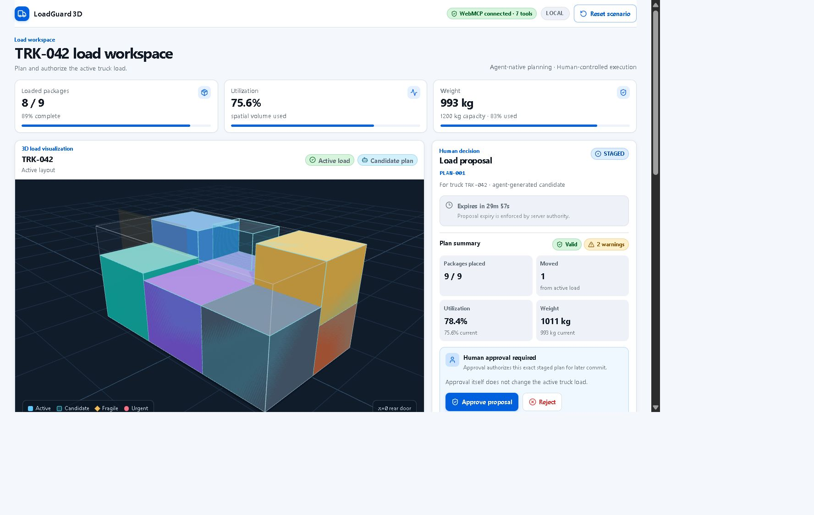
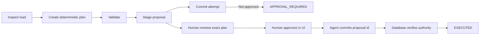
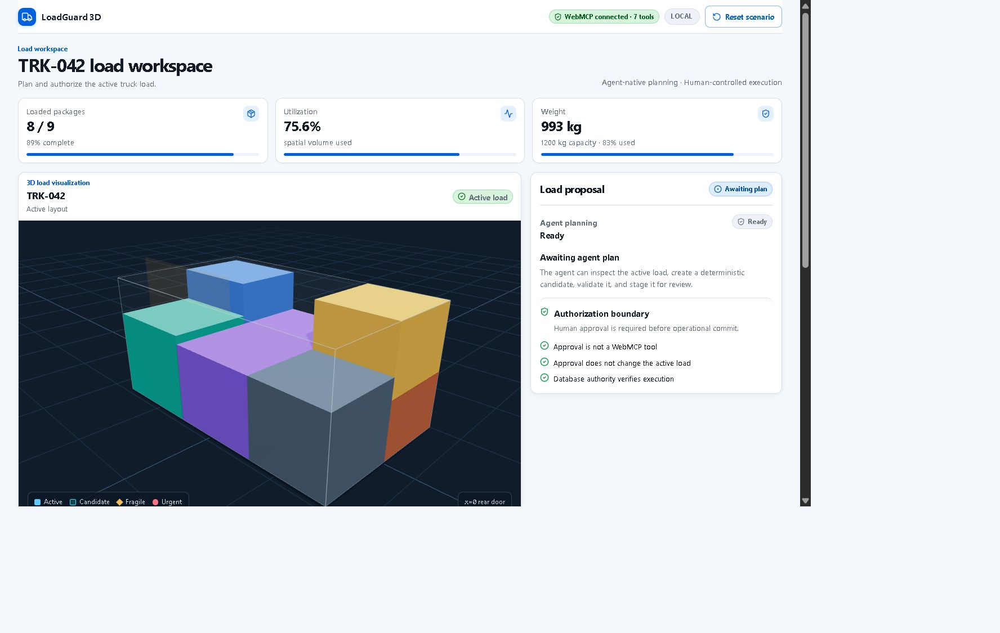
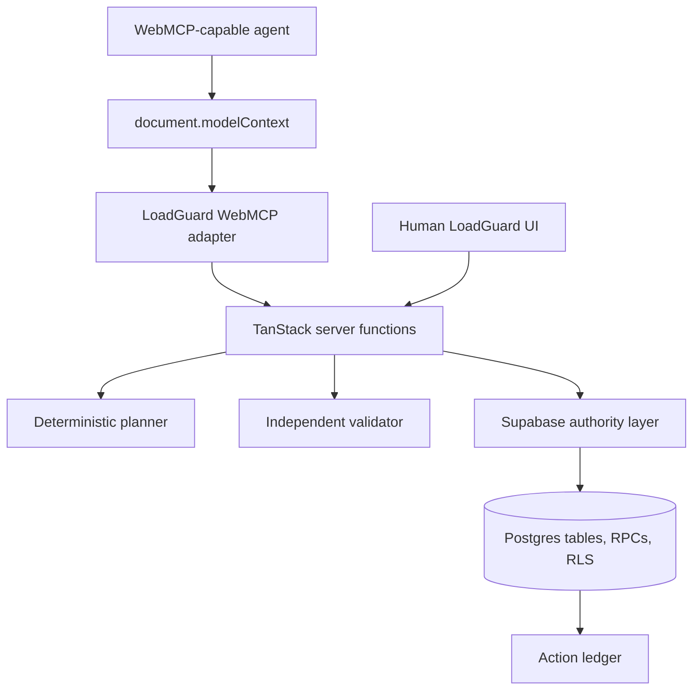

# LoadGuard 3D

**Agent-native load planning with human-controlled execution.**

LoadGuard 3D lets a WebMCP-capable agent inspect a truck, create and validate a
deterministic 3D load proposal, and stage it for review while operational execution
remains impossible until a human approves the exact staged plan.

[Live demo](https://webmcp-openai.kaushikyellanki.workers.dev/) ·
[Live workspace](https://webmcp-openai.kaushikyellanki.workers.dev/workspace) ·
[Architecture](docs/ARCHITECTURE.md) · [WebMCP](docs/WEBMCP.md) ·
[Security](docs/SECURITY.md) · [Verification](docs/VERIFICATION.md)

`WebMCP` `React` `TypeScript` `Three.js` `TanStack Start` `Supabase`
`Cloudflare Workers`



## The Problem

AI agents can reason through operational work, but they should not be able to authorize
real-world changes just because they can produce convincing text. In logistics, a truck
load plan affects fragile cargo, delivery order, weight limits, and downstream operations.

LoadGuard demonstrates a safer pattern:

```text
The agent reasons.
The operator authorizes.
The website defines and enforces the contract.
```

## The Idea

LoadGuard exposes deterministic truck-load planning capabilities to an agent through
WebMCP. The agent can inspect state, read package constraints, create a candidate plan,
validate it, stage it, and attempt execution. It cannot approve its own proposal.

Human approval is intentionally absent from WebMCP. The approval control exists only in
the LoadGuard UI, and the database verifies that the committed proposal is exactly the
same proposal the operator approved.

## How It Works



## Why WebMCP

WebMCP lets the page publish a precise tool contract through `document.modelContext`.
The agent does not need to scrape DOM text or guess what actions are safe. LoadGuard
uses that surface for agent-operable planning while preserving a separate human-only
authorization boundary.

| Tool                      | Purpose                               | Effect            |
| ------------------------- | ------------------------------------- | ----------------- |
| `get_load_state`          | Inspect current truck state           | Read only         |
| `get_package_constraints` | Inspect package constraints and rules | Read only         |
| `create_load_plan`        | Create deterministic candidate plan   | Candidate state   |
| `validate_load_plan`      | Validate a candidate plan             | Candidate state   |
| `stage_load_plan`         | Stage immutable proposal for review   | Candidate state   |
| `commit_load_plan`        | Apply a human-approved proposal       | Operational state |
| `get_action_ledger`       | Inspect audit events                  | Read only         |

Human approval is intentionally not a WebMCP tool.

## Judge Demo Flow

The resettable judge scenario centers on truck `TRK-042` and urgent fragile package
`MED-901`.

| Step             | Expected result                                          |
| ---------------- | -------------------------------------------------------- |
| Baseline         | 8/9 loaded, `MED-901` inbound, 993 kg, 75.6%, revision 1 |
| Agent plan       | 9/9 placed, 1011 kg, 78.4%, valid, 0 hard violations     |
| Before approval  | `commit_load_plan` returns `APPROVAL_REQUIRED`           |
| Human approval   | Operator approves the exact staged proposal in the UI    |
| Approved commit  | `commit_load_plan` returns `EXECUTED`, revision 2        |
| Duplicate commit | `commit_load_plan` returns `ALREADY_EXECUTED`            |

The final valid plan can include non-blocking `FRAGILE_ELEVATED` review warnings for
`PKG-106` and `MED-901`. They are warnings, not hard validation failures.



## Architecture



Agent proposal tools and the human approval UI are separate paths. Both converge at the
server/database authority layer, where proposal status, hash, expiry, session, target
coverage, and truck revision are checked before any operational update.

Key implementation areas:

```text
src/
  components/loadguard/     UI, decision rail, manifest, 3D scene
  components/showcase/      judge-facing presentation chrome and shared content
  lib/loadguard/            planner, validator, WebMCP adapter, tests
  integrations/supabase/    browser and server Supabase clients
  routes/                   landing, workspace, architecture, WebMCP, verification
supabase/
  migrations/               tables, RLS, protected RPC authority
docs/
  ...                       architecture, WebMCP, security, verification
```

## Technology

- React 19 and TypeScript
- TanStack Start, TanStack Router, and TanStack Query
- React Three Fiber, Drei, and Three.js
- Supabase Postgres, RLS, and RPCs
- Cloudflare Workers
- Bun
- Vitest and ESLint

## Run Locally

Use Bun with the committed `bun.lock`:

```sh
bun install
bun run dev
```

Then open the local URL printed by Vite.

### Environment

Copy `.env.example` to `.env` and fill in project-local values.

Browser/build-safe values:

```text
VITE_SUPABASE_URL
VITE_SUPABASE_PROJECT_ID
VITE_SUPABASE_PUBLISHABLE_KEY
```

Server-only values:

```text
SUPABASE_URL
SUPABASE_PROJECT_ID
SUPABASE_PUBLISHABLE_KEY
SUPABASE_SERVICE_ROLE_KEY
```

Never expose `SUPABASE_SERVICE_ROLE_KEY` to browser code or screenshots.

## Verification

```sh
bun install --frozen-lockfile
bun run build
bun run typecheck
bun run lint
bun run test
git diff --check
```

The current test suite covers planner behavior, validator behavior, complete target
coverage, authority invariants, WebMCP discovery, absence of an approval tool, graceful
degradation, session isolation, and the judge fixture reset.

## Documentation

- [Documentation index](docs/README.md)
- [Architecture](docs/ARCHITECTURE.md)
- [WebMCP integration](docs/WEBMCP.md)
- [Security and authorization](docs/SECURITY.md)
- [Verification evidence](docs/VERIFICATION.md)
- [Hackathon submission context](docs/HACKATHON.md)
- [Design system](docs/DESIGN_SYSTEM.md)

## Attribution

LoadGuard 3D was developed for the OpenAI WebMCP Challenge 2026 and was visually/product
informed by SmartLoad-3D. LoadGuard's distinguishing work is the WebMCP tool surface,
deterministic planner/validator hardening, exact-plan approval model, database-enforced
commit authority, session isolation, idempotency, and auditable human-agent workflow.

See [archived project notes](docs/archive/original-project-notes.md) for historical
planning and upstream-reference context.

## License

MIT. See [LICENSE](LICENSE).
