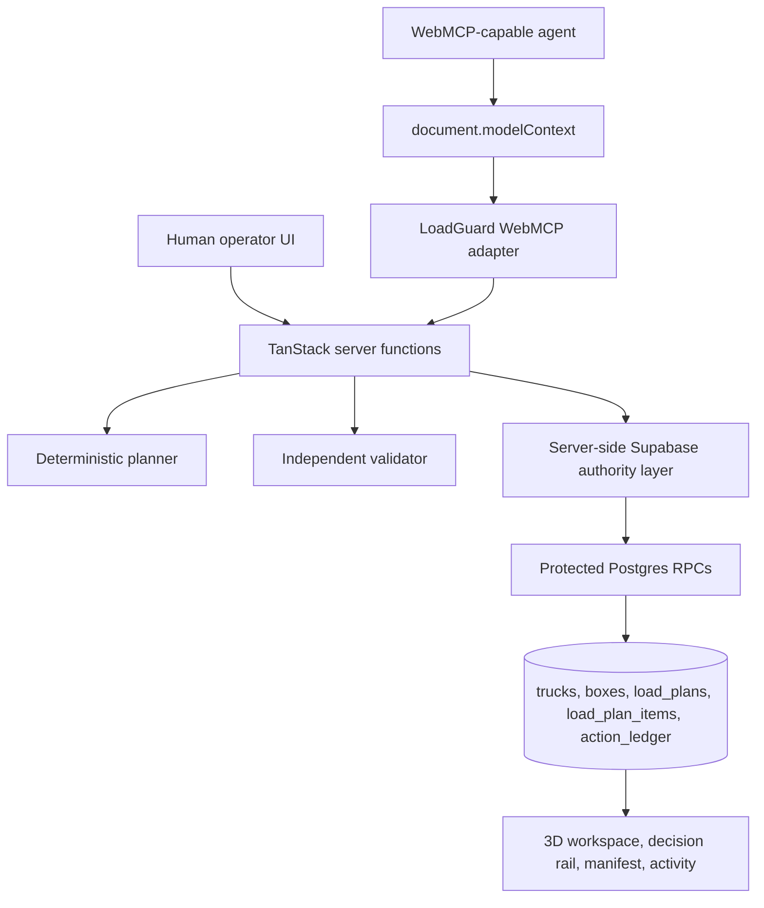

# Architecture

LoadGuard 3D is a TanStack Start application that exposes deterministic logistics tools
to WebMCP while keeping operational authority in the application and database.

## Frontend

- `src/routes/index.tsx` owns the LoadGuard workspace route.
- `src/components/loadguard/TruckScene.tsx` renders active cargo and candidate plans with React Three Fiber.
- `src/components/loadguard/panels.tsx` renders the product shell, metrics, decision rail, manifest, activity feed, and WebMCP status.
- `src/components/loadguard/AgentConsole.tsx` keeps the local demo controls visually secondary while exercising the same application handlers.

## Planning And Validation

- `src/lib/loadguard/planner.ts` creates deterministic candidate placements.
- `src/lib/loadguard/validator.ts` independently validates weight, bounds, collision, unloading order, target coverage, and fragile-cargo warnings.
- The planner and validator are shared by human UI paths and WebMCP paths.

## WebMCP Adapter

`src/lib/loadguard/webmcp.ts` registers exactly seven tools through `document.modelContext`.
The adapter normalizes responses, labels authority as site-enforced, and degrades gracefully
when WebMCP is unavailable.

## Server Authority

`src/lib/loadguard.functions.ts` defines TanStack server functions. They call
`src/lib/loadguard.server.ts`, which uses the server-only Supabase client and protected RPCs.

The commit path accepts only a proposal id. It does not accept fresh coordinates, package
membership, or agent-supplied approval state. The database verifies proposal status,
approved hash, expiry, session, complete target coverage, and truck revision before
updating the active load.

## Data Layer

Supabase migrations define:

- `trucks`
- `boxes`
- `load_plans`
- `load_plan_items`
- `action_ledger`
- protected RPCs for approval, rejection, commit, and canonical plan hashing
- RLS enabled on the core tables

The active load and candidate proposals are stored separately so staging and approval do
not mutate the operational truck state.
