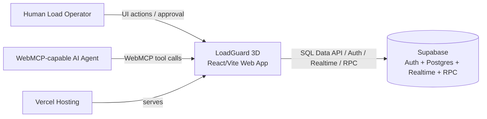
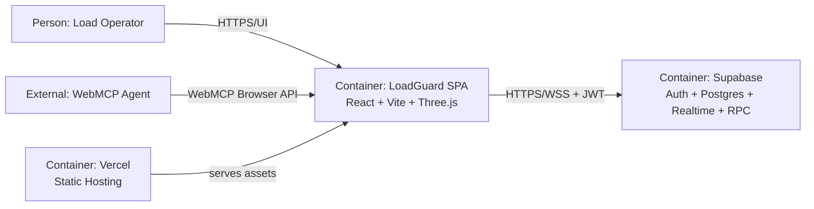
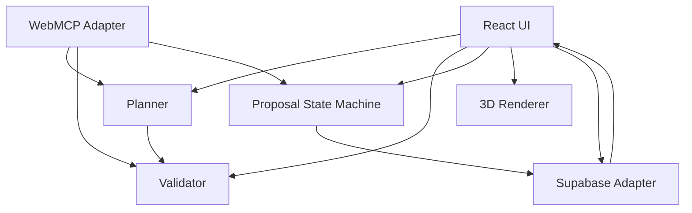
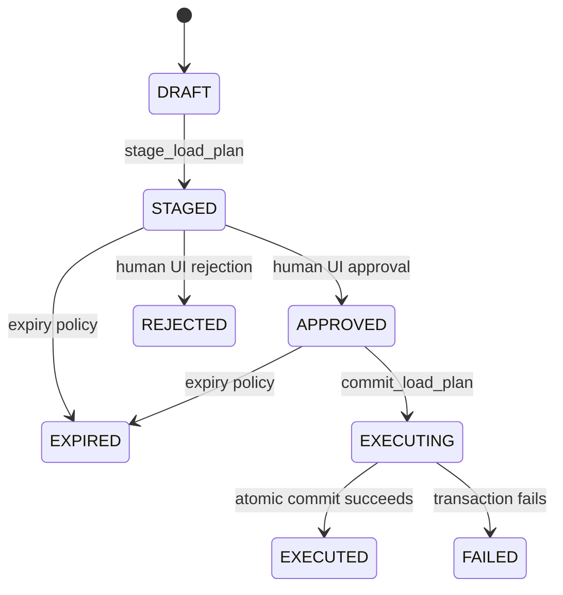
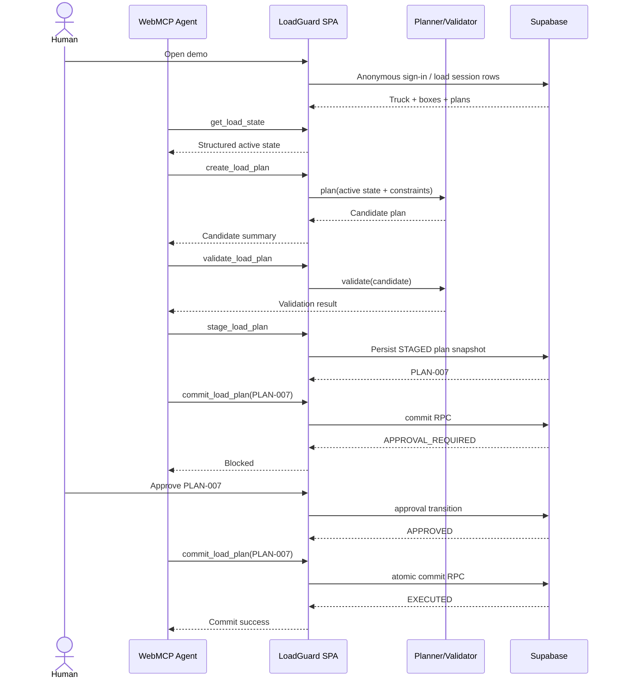
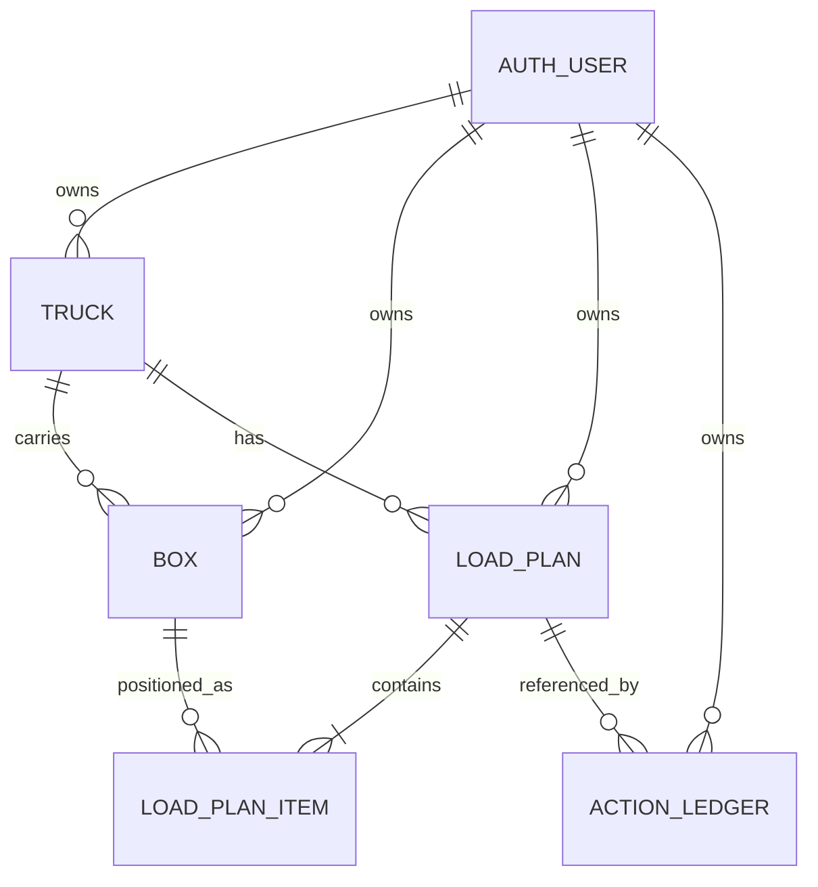
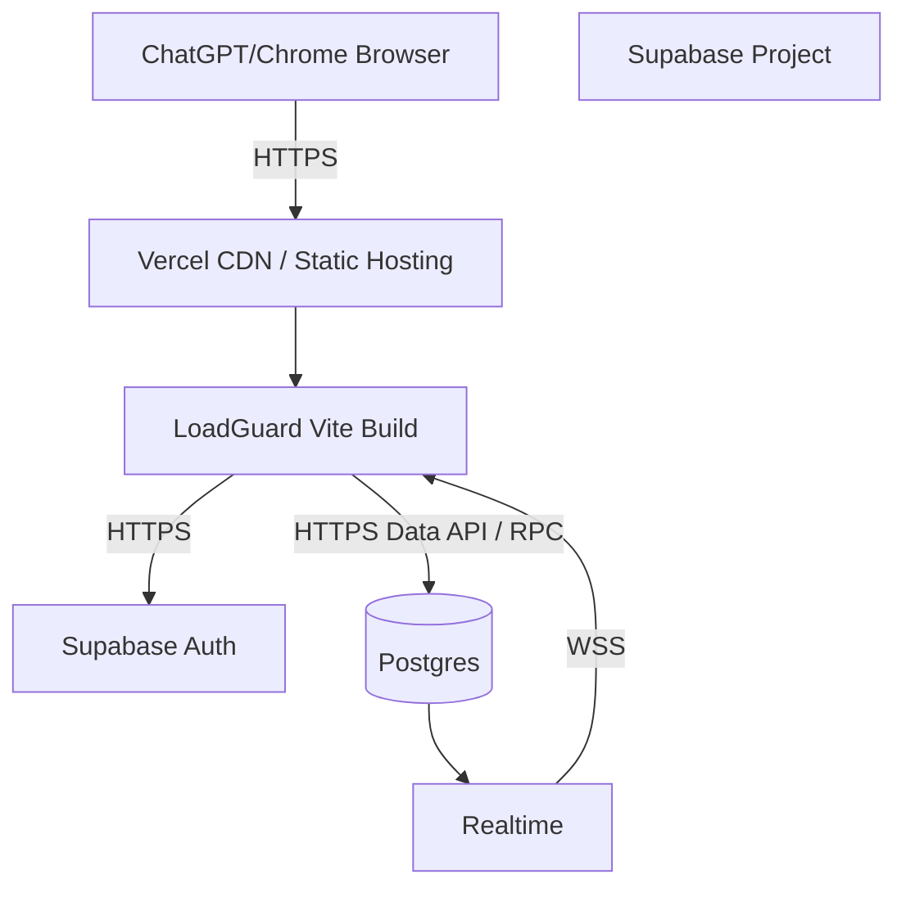

# Original Project Notes

This archived document preserves historical planning, upstream-reference, and attribution
context from the original LoadGuard/SmartLoad transformation notes. It is not the current
public README or authoritative deployment guide.

Current project documentation starts at [docs/README.md](../README.md).

---

# LoadGuard 3D — Deep Technical Architecture & Engineering Documentation

> **Document type:** Master Technical Architecture / Engineering Design Document  
> **Documentation model:** Docs-as-Code  
> **Recommended filename:** `DEEP_TECHNICAL_ARCHITECTURE.md`  
> **Status:** Draft  
> **System:** LoadGuard 3D  
> **Project:** OpenAI WebMCP Challenge 2026  
> **Document version:** 0.3  
> **Target system version:** 0.1.0-hackathon  
> **Current upstream baseline:** SmartLoad-3D `0.0.0`  
> **Last updated:** 2026-08-30  
> **Primary owner:** Kaushik  
> **Technical owner:** Kaushik  
> **Security owner:** Kaushik  
> **Operations owner:** Kaushik

---

# How to Use This Document

This file is the authoritative master architecture for LoadGuard 3D and is maintained as Docs-as-Code with the implementation repository.

1. `[CURRENT]` means verified against source/configuration/runtime evidence.
2. `[TARGET]` means approved design that is not yet implementation evidence.
3. `[TBD]` stays until code, configuration, tests, deployment, or measurement resolves it.
4. `[N/A]` is used when a template section deliberately does not apply.
5. Implementation changes that alter architecture must update this document or create explicit technical debt/ADR traceability.
6. Stable IDs for requirements, components, APIs, dependencies, risks, ADRs, failure modes, runbooks, and controls should not be renumbered after use.

# Documentation Rules

- Describe implementation, not assumptions; target-only behavior is marked `[TARGET]`.
- Use exact names for tools, RPCs, tables, components, repositories, and dependencies once created.
- Do not invent performance, capacity, availability, recovery, or security evidence.
- Never include private keys, service-role keys, passwords, access/session tokens, or real customer data.
- Prefer Mermaid/source-controlled diagrams.
- Important claims should trace to code, SQL/migrations, configuration, tests, deployment evidence, runtime evidence, or ADRs.
- Upstream SmartLoad behavior and LoadGuard additions remain explicitly separable for engineering and licensing traceability.

# Documentation Markers

## Architecture Status Legend

This document deliberately separates verified current implementation from the hackathon target architecture.

| Marker          | Meaning                                                          |
| --------------- | ---------------------------------------------------------------- |
| `[CURRENT]`     | Verified in the upstream SmartLoad-3D codebase as of 2026-08-30. |
| `[TARGET]`      | Approved LoadGuard 3D hackathon design to be implemented.        |
| `[REQUIRED]`    | Expected for the LoadGuard 3D MVP.                               |
| `[CONDITIONAL]` | Include only when applicable.                                    |
| `[EVIDENCE]`    | Requires measurable or independently verifiable evidence.        |
| `[OWNER]`       | Accountable person/team.                                         |
| `[DECISION]`    | Architectural decision or trade-off.                             |
| `[RISK]`        | Technical/business/security risk.                                |
| `[TBD]`         | Information is not yet known or not yet implemented.             |
| `[N/A]`         | Deliberately not applicable to the hackathon MVP.                |

> **Accuracy rule:** No target-state statement in this document should be represented as implemented evidence until the corresponding code, test, deployment, or runtime observation exists.

---

# 0. Document Governance

## 0.1 Document Identity `[REQUIRED]`

| Field                    | Value                                                   |
| ------------------------ | ------------------------------------------------------- |
| Document ID              | `LG3D-ARCH-001`                                         |
| Project                  | LoadGuard 3D                                            |
| System                   | LoadGuard 3D                                            |
| Target repository        | `TBD — fork/target repository has not yet been created` |
| Upstream repository      | `https://github.com/Namdevx/SmartLoad-3D`               |
| Document version         | `0.3`                                                   |
| Target system version    | `0.1.0-hackathon`                                       |
| Upstream package version | `0.0.0`                                                 |
| Status                   | Draft                                                   |
| Classification           | Public                                                  |
| Created                  | 2026-08-30                                              |
| Updated                  | 2026-08-30                                              |

## 0.2 Document Purpose `[REQUIRED]`

This document is the authoritative engineering design for transforming the existing SmartLoad-3D application into **LoadGuard 3D**, an agent-native 3D truck load-planning system for the OpenAI WebMCP Challenge.

It answers four categories of questions:

1. **What exists now?** — verified upstream React/Vite/Supabase/Three.js behavior.
2. **What are we building?** — the minimum viable LoadGuard 3D product and WebMCP capability surface.
3. **How will authority be enforced?** — candidate plans, staged proposals, human approval, exact-plan commit, and action ledger.
4. **How will we prove it works?** — deterministic validation, tests, deployed demo, WebMCP execution evidence, and a resettable judge scenario.

The document is intentionally conservative. Production-grade controls that do not exist in the MVP are marked `TBD`, `TARGET`, or `N/A` rather than implied.

## 0.3 Intended Audience `[REQUIRED]`

| Audience              | Why They Need This Document                                      |
| --------------------- | ---------------------------------------------------------------- |
| Project engineer      | Build order, interfaces, state model, tests, deployment          |
| Hackathon reviewer    | Understand WebMCP leverage and implementation boundaries         |
| Frontend engineer     | 3D rendering, shared UI state, WebMCP registration               |
| Backend/data engineer | Supabase schema, RLS, plan transitions, ledger                   |
| Security reviewer     | Human-approval boundary, session isolation, write controls       |
| QA engineer           | Deterministic planner/validator and critical end-to-end workflow |
| Future maintainer     | Separate inherited SmartLoad code from LoadGuard additions       |

## 0.4 Ownership `[OWNER]`

| Area                  | Owner   |
| --------------------- | ------- |
| Product               | Kaushik |
| Architecture          | Kaushik |
| Frontend              | Kaushik |
| Load-planning domain  | Kaushik |
| Supabase/data         | Kaushik |
| WebMCP integration    | Kaushik |
| Security              | Kaushik |
| Deployment/operations | Kaushik |
| Documentation         | Kaushik |

## 0.5 Review and Approval

| Role                  | Name/Team | Status                              | Date       |
| --------------------- | --------- | ----------------------------------- | ---------- |
| Author                | Kaushik   | Drafting                            | 2026-08-30 |
| Architecture reviewer | TBD       | Pending                             | TBD        |
| Security reviewer     | TBD       | Pending                             | TBD        |
| Operations reviewer   | TBD       | Pending                             | TBD        |
| Approver              | Kaushik   | Pending implementation verification | TBD        |

## 0.6 Revision History

| Version              | Date       | Author  | Description                                                                                                                                                                                                                                                                                                                                                                                                                              |
| -------------------- | ---------- | ------- | ---------------------------------------------------------------------------------------------------------------------------------------------------------------------------------------------------------------------------------------------------------------------------------------------------------------------------------------------------------------------------------------------------------------------------------------- |
| 0.1                  | 2026-08-30 | Kaushik | Initial architecture derived from SmartLoad-3D baseline and finalized LoadGuard 3D concept                                                                                                                                                                                                                                                                                                                                               |
| 0.2                  | 2026-08-30 | Kaushik | Completeness audit against master template; added missing governance, component, RPC, messaging, health, dependency, multi-tenant-N/A, and documentation-completion coverage                                                                                                                                                                                                                                                             |
| 0.3                  | 2026-08-30 | Kaushik | Concept-integration audit; explicitly mapped SmartLoad-3D + IncidentGuard design principles, added structured provenance, model-text-is-not-authorization control, trust vocabulary, visible tool-effect requirements, and WebMCP standards guardrails                                                                                                                                                                                   |
| 0.3-current-evidence | 2026-08-30 | Codex   | [CURRENT] Completion pass verified React 19/TanStack Start implementation, server-only Supabase authority layer, deterministic planner/validator tests, WebMCP registration through `document.modelContext`, no WebMCP approval tool, TRK-042/MED-901 fixture, README/license/report updates. Runtime Supabase migration execution and live WebMCP browser smoke test remain [TBD] until project credentials/browser host are available. |

---

# 1. Executive Technical Overview

## 1.1 System Summary `[REQUIRED]`

**LoadGuard 3D** is a browser-based logistics planning application in which a human warehouse/load operator and a WebMCP-capable AI agent collaborate on the same truck-loading state. The system is designed around the principle: **the agent reasons; the operator authorizes; the website defines the contract.**

The project begins from SmartLoad-3D, an existing React + TypeScript + Vite SPA. `[CURRENT]` The upstream application includes an interactive Three.js truck visualization, editable truck dimensions, box CRUD, a simple deterministic stacking algorithm, space-utilization calculation, Supabase-backed box persistence, Supabase realtime updates, a dashboard, and report generation.

`[CURRENT]` The box model includes an ID, three-dimensional size, weight, destination, fragility flag, creation time, and optional 3D position. The current stacking algorithm sorts non-fragile boxes before fragile boxes, then by weight and volume, and places fragile boxes above the maximum height reached by non-fragile boxes. It does not implement collision-aware optimization, delivery-stop accessibility, approved-plan state, or WebMCP.

`[TARGET]` LoadGuard 3D retains the existing visual stack but changes the product from a passive visualization tool into an **agent-operable logistics command surface**. The website will register a deliberately small set of WebMCP tools through `document.modelContext.registerTool()`. Read-oriented tools will expose normalized load state and constraints. Planning tools will generate and validate a candidate plan. Mutation tools will stage a plan and commit only a previously human-approved proposal.

The primary hackathon scenario is deterministic: truck `TRK-042` has an existing load, and an urgent package `MED-901` must be inserted without capacity, collision, fragility, weight-placement, or unloading-order violations. The agent can inspect the current truck, generate a candidate plan, validate it, and stage it. The page shows the proposed positions as a visual candidate state. The agent's attempt to commit before approval must fail. The human then explicitly approves the exact staged plan, after which the agent can commit it.

`[TARGET]` The authoritative operational state will live in a project-owned Supabase deployment. The target data model adds trucks, load plans, load-plan items, approval fields, ownership/session fields, and an action ledger while retaining the existing `boxes` table name to minimize rewiring. Supabase Anonymous Auth is the planned no-PII session mechanism so each judge/browser session has an authenticated UUID and Row-Level Security can isolate state without account signup.

`[TARGET]` Consequential state transitions are enforced in database/RPC logic rather than trusted solely to React state. A staged plan is treated as an immutable snapshot. Human approval records the proposal identity and approved hash. The WebMCP commit tool accepts only `proposal_id`; it does not accept fresh package coordinates or mutation arguments. Commit must reject proposals that are unapproved, stale, already executed, rejected, expired, or whose approved hash no longer matches.

The browser remains the primary runtime. No system-owned LLM is required. The AI reasoning layer is the user's WebMCP-aware agent (for example ChatGPT's supported in-app browser). This is intentional: LoadGuard demonstrates WebMCP leverage directly instead of wrapping a second model API behind the webpage.

Deployment is targeted at Vercel for the Vite frontend and Supabase for Auth, Postgres, Realtime, and RPC/database functions. No Kubernetes, queue, cache, vector store, RAG system, fleet telemetry, GPS, real truck controller, or production dispatch integration is in the hackathon scope.

## 1.2 One-Minute Architecture

### System

LoadGuard 3D is a **single-page agent-native logistics planning application** that provides truck-load inspection, deterministic planning, validation, staged proposals, human approval, exact-plan commit, 3D visualization, and an action ledger to warehouse/load operators and WebMCP-capable agents.

### Primary Architectural Components

1. `CMP-WEB-001` — React/Vite SPA and shared UI state
2. `CMP-3D-001` — React Three Fiber / Three.js truck renderer
3. `CMP-MCP-001` — WebMCP tool registration adapter
4. `CMP-PLAN-001` — deterministic load-planning engine
5. `CMP-VAL-001` — deterministic load validator
6. `CMP-AUTHZ-001` — proposal/approval/commit state machine
7. `CMP-DB-001` — Supabase Auth/Postgres/Realtime
8. `CMP-LEDGER-001` — action-ledger module
9. `CMP-DEMO-001` — deterministic judge scenario/reset

### Primary Request Flow

```text
Human / WebMCP Agent
        ↓
React/Vite LoadGuard UI
        ↓
Shared domain functions + WebMCP tool adapter
        ↓
Planner / Validator / Proposal state machine
        ↓
Supabase Auth + Postgres + RPC
        ↓
Realtime state update
        ↓
3D visualization + proposal panel + action ledger
```

## 1.3 Concept Integration — SmartLoad-3D + Human-Authorized Agent Operations `[DECISION]`

LoadGuard 3D is deliberately the **fusion of two ideas**, not a renamed copy of either one.

### Source A — SmartLoad-3D operational/visual foundation

`[CURRENT]` SmartLoad-3D contributes the concrete logistics domain and existing implementation substrate:

- React + TypeScript + Vite single-page application;
- interactive React Three Fiber / Three.js truck visualization;
- truck dimension configuration;
- package/box CRUD;
- package dimensions, weight, destination, fragility, creation time, and optional 3D position;
- deterministic box-positioning utility;
- space-utilization calculation;
- Supabase-backed persistence and Realtime refresh;
- dashboard/reporting UI.

LoadGuard keeps those useful primitives but does **not** treat the upstream stacking algorithm as a production optimizer. It becomes the starting point for a deterministic planner + validator architecture.

### Source B — IncidentGuard human-authorized capability model

The IncidentGuard design contributes the interaction and trust model:

1. **The website is the capability contract.** The agent calls explicit WebMCP tools instead of inferring meaning from DOM controls.
2. **Human and agent share one live application state.** Material agent tool use is reflected in the same UI the human views.
3. **Reasoning is not authority.** Agent reasoning can inspect, plan, validate, and stage; it cannot grant permission to commit.
4. **Application state is authorization.** Natural-language statements such as "the user approved" are never authorization evidence.
5. **Stage before execute.** Candidate generation and validation are separated from the exact proposal that may become active.
6. **Approve the exact operation, not a capability token.** The agent receives only a `proposal_id`; the protected commit path independently verifies the stored approved snapshot.
7. **Consequential actions fail closed and visibly.** Commit before approval must fail and leave active state unchanged.
8. **The ledger records events, not hidden reasoning.** Actor, action/tool, identifiers, result, timestamp, and summary are recorded; chain-of-thought is not.
9. **Use only current WebMCP semantics.** `readOnlyHint` and `untrustedContentHint` are used only where appropriate; speculative annotations such as `consequentialHint` are not claimed as standardized behavior.
10. **One deterministic scenario beats a broad unreliable simulator.** The judge flow centers on `TRK-042` + `MED-901`.

### Combined Product Thesis

> **LoadGuard 3D is an agent-native logistics command surface in which the website exposes explicit load-planning capabilities through WebMCP, the agent performs the investigative/planning workflow, the human authorizes the exact consequential change, and both participants observe the same operational state.**

### Integration Matrix

| Design element     | SmartLoad-3D contribution | IncidentGuard-derived contribution    | LoadGuard 3D result                                  |
| ------------------ | ------------------------- | ------------------------------------- | ---------------------------------------------------- |
| Domain             | Truck/package loading     | Consequential operational workflow    | Human-authorized load planning                       |
| Visual state       | 3D truck + boxes          | Shared human/agent state              | Active vs candidate/proposed 3D load                 |
| Agent interface    | None                      | Explicit website-defined capabilities | Seven WebMCP tools                                   |
| Planning           | Basic client stacking     | Domain primitives + agent workflow    | Deterministic planner + validation                   |
| Authority          | Direct CRUD               | Human approval gate                   | `STAGED → APPROVED → EXECUTED`                       |
| Mutation integrity | Direct writes             | Exact approved snapshot               | Commit accepts only `proposal_id`                    |
| Trust semantics    | None                      | Read-only/untrusted distinction       | Current WebMCP hints + app-owned authority labels    |
| Traceability       | Console/toasts            | Visible action history                | Structured action ledger                             |
| Demo               | 3D visualization          | Block-before-approval moment          | Pre-approval rejection + post-approval 3D activation |
| Reliability        | Existing UI               | Deterministic scenario/reset          | `TRK-042` + `MED-901` reset fixture                  |

## 1.4 Architecture at a Glance

| Dimension          | Current                                         | Target                                                                       |
| ------------------ | ----------------------------------------------- | ---------------------------------------------------------------------------- |
| Architecture style | Browser SPA with direct Supabase data access    | Modular browser SPA + Supabase-backed state machine                          |
| Primary language   | TypeScript                                      | TypeScript + SQL/PLpgSQL for protected transitions                           |
| Frontend           | React 18.2 + Vite                               | React 18.2 + Vite                                                            |
| 3D                 | Three.js + React Three Fiber + Drei             | Same, extended for active/candidate state                                    |
| Backend            | Supabase client direct to Postgres              | Supabase Auth/Postgres/Realtime + protected RPC functions                    |
| Database           | Supabase Postgres `boxes`                       | Extended `boxes`, `trucks`, `load_plans`, `load_plan_items`, `action_ledger` |
| Cache              | N/A                                             | N/A                                                                          |
| Messaging          | Supabase Realtime subscription                  | Supabase Realtime subscription                                               |
| Hosting            | Upstream has successful Vercel status           | Vercel target deployment                                                     |
| Authentication     | Not verified                                    | Supabase anonymous auth                                                      |
| Authorization      | RLS status not verified                         | RLS by `auth.uid()` + protected plan transitions                             |
| WebMCP             | None                                            | `document.modelContext.registerTool()`                                       |
| CI/CD              | Vercel status visible upstream; CI not verified | GitHub Actions + Vercel deployment target                                    |
| Observability      | Browser console/toasts                          | Structured action ledger + browser/hosting/Supabase logs                     |

---

# 2. Problem, Goals, Scope, and Constraints

## 2.1 Problem Statement `[REQUIRED]`

### Current Problem

Truck-loading software and warehouse dashboards are predominantly human-operated interfaces. An AI agent attempting to assist must infer controls from visual UI structure, which is slow, ambiguous, and brittle. At the same time, allowing an agent to directly mutate a dispatch/load plan creates an authority problem: planning intelligence and operational authorization should not be conflated.

LoadGuard 3D solves a narrow version of this problem by making the loading website itself an explicit capability surface. The agent receives structured tools for inspection, planning, validation, staging, and commit. Consequential activation of a load plan is separated from planning and requires a human-approved proposal state.

### Why the Problem Matters

- **Operator impact:** repetitive inspection and plan recomputation can be delegated while the human retains final control.
- **Agent reliability:** structured tools remove dependence on DOM interpretation for core domain actions.
- **Operational integrity:** a proposed plan is not automatically an active plan.
- **Explainability:** proposed moves, violations, and state transitions are visible in the same UI.
- **Hackathon relevance:** the human and agent genuinely share one live page and application state rather than using a detached chatbot.

## 2.2 Business Goals

| ID     | Goal                                    | Success Metric                                                          | Owner   |
| ------ | --------------------------------------- | ----------------------------------------------------------------------- | ------- |
| BG-001 | Demonstrate non-trivial WebMCP leverage | Judge can complete end-to-end scenario through registered tools         | Kaushik |
| BG-002 | Demonstrate human-agent collaboration   | Commit is blocked before human approval and succeeds after approval     | Kaushik |
| BG-003 | Produce a memorable visual demo         | Candidate/active plan changes are visible in 3D during the demo         | Kaushik |
| BG-004 | Ship within hackathon timeframe         | Public live app + public repo + required demo materials before deadline | Kaushik |

## 2.3 Technical Goals

| ID     | Goal                              | Measurement                                                                              |
| ------ | --------------------------------- | ---------------------------------------------------------------------------------------- |
| TG-001 | Use current WebMCP imperative API | Tools registered via `document.modelContext` and discoverable in supported environment   |
| TG-002 | Deterministic planning            | Identical normalized input and algorithm version produce identical candidate coordinates |
| TG-003 | Deterministic validation          | Same plan returns same violation set and score                                           |
| TG-004 | Enforce plan authority boundary   | `commit_load_plan` fails for non-APPROVED proposal                                       |
| TG-005 | Prevent mutation substitution     | Commit accepts only proposal ID and executes stored proposal snapshot                    |
| TG-006 | Keep judge scenario repeatable    | Reset restores exact seed truck/package/plan state                                       |
| TG-007 | Preserve session isolation        | Browser sessions cannot read/write another authenticated session's demo rows under RLS   |
| TG-008 | Keep frontend responsive          | `[TBD/EVIDENCE]` measure planner and 3D performance after implementation                 |

## 2.4 Non-Goals `[REQUIRED]`

- Real fleet management or dispatch orchestration
- GPS, routing, or driver tracking
- Real warehouse scanners or IoT telemetry
- Production-grade 3D bin-packing optimality
- Mixed-integer optimization or global optimality proof
- Real vehicle axle-load engineering certification
- Real hazardous-material handling
- User organizations, billing, RBAC administration, or multi-tenant SaaS
- RAG, vector database, or embedded chatbot
- Multi-agent orchestration
- Real-world autonomous execution against trucks or warehouse machinery

### Product/Interaction Non-Goals Derived from the Combined Concept

LoadGuard explicitly does **not** attempt to:

- embed a second chatbot/LLM inside the site;
- make the agent supply raw 3D coordinates as the trusted execution payload;
- collapse inspection/planning/validation/approval/commit into one `do_everything` tool;
- treat a model statement as proof of human consent;
- build a prompt-injection arena, policy engine, security scorecard, or generic tool-risk platform;
- claim industrial packing optimality from the hackathon planner;
- claim the action ledger is tamper-proof/compliance-grade;
- turn the 3D scene into a generic creative 3D editor;
- depend on real trucks, IoT, GPS, fleet APIs, or production dispatch infrastructure.

## 2.5 In Scope

- One truck planning workspace
- Synthetic package inventory
- 3D active-plan visualization
- Candidate plan visualization
- Deterministic constraints and validator
- WebMCP tools
- Staging/approval/commit state machine
- Session isolation for public demo
- Action ledger
- Deterministic reset scenario
- Public Vercel deployment
- Supabase persistence

## 2.6 Out of Scope

- Production logistics integrations
- Background optimization jobs
- ML-based packing
- External AI APIs
- Mobile app
- Offline sync
- Payment or customer data
- Real operational SLA

## 2.7 Assumptions

| ID      | Assumption                                                                   | Impact if False                                                    | Owner   | Status                                       |
| ------- | ---------------------------------------------------------------------------- | ------------------------------------------------------------------ | ------- | -------------------------------------------- |
| ASM-001 | Judges can access a WebMCP-capable environment                               | Core agent workflow cannot be demonstrated                         | Kaushik | Confirmed by challenge docs                  |
| ASM-002 | SmartLoad-3D can be forked under its stated MIT licensing intent             | Must replace/rewrite upstream code if licensing is not acceptable  | Kaushik | Risk: root LICENSE not found upstream        |
| ASM-003 | Supabase anonymous auth can isolate demo sessions without collecting PII     | Need alternate session model                                       | Kaushik | Confirmed capability, implementation pending |
| ASM-004 | One deterministic truck scenario is sufficient to demonstrate product thesis | Broader scenario support would be needed                           | Kaushik | Design decision                              |
| ASM-005 | WebMCP agent uses declared tools for consequential operation in judge flow   | UI-clicking agent could weaken the human-only approval distinction | Kaushik | Documented limitation                        |

## 2.8 Constraints

### Technical Constraints

- WebMCP remains experimental and subject to API change.
- The existing application is React/Vite, so migration to another framework is intentionally avoided.
- Existing box coordinates use axis-aligned placement; arbitrary box rotation is not in MVP.
- Browser 3D performance limits practical package counts.

### Business Constraints

- Hackathon deadline is September 3, 2026 at 1:00 PM PT.
- Submission requires a working live app, public code, description, and demo video.

### Organizational Constraints

- Single primary developer/owner unless team changes.

### Regulatory Constraints

`N/A — synthetic logistics demonstration; no regulated production operation or personal dataset is in scope.`

### Legacy Constraints

- Existing `boxes` naming and direct Supabase patterns should be reused where doing so reduces time without compromising approval enforcement.

### Financial Constraints

- Prefer free/hackathon-tier Vercel and Supabase usage.

---

# 3. Stakeholders and Architecture Drivers

## 3.1 Stakeholder Register

| Stakeholder             | Concerns                                          | Decisions Influenced                   |
| ----------------------- | ------------------------------------------------- | -------------------------------------- |
| Warehouse/load operator | Safety, clarity, reversibility, approval          | Candidate vs active plan, approval UX  |
| AI agent                | Clear tools, schemas, predictable outputs         | WebMCP interface design                |
| Hackathon judge         | WebMCP leverage, execution, originality           | Demo flow, deterministic scenario      |
| Engineering owner       | Build speed, maintainability                      | React/Vite reuse, small backend        |
| Security reviewer       | Agent authority, tampering, public demo isolation | Immutable proposal, RLS, commit checks |

## 3.2 Architecture Drivers `[REQUIRED]`

### Functional Drivers

- Inspect current load state through structured tools.
- Generate a candidate arrangement from package/truck constraints.
- Validate candidate plan deterministically.
- Stage a plan without activating it.
- Require human approval before commit.
- Execute exact stored approved plan.
- Visibly synchronize tool actions with the UI.
- Reset the judge scenario.

### Quality Drivers

1. **Correctness** — invalid coordinates or unsafe constraint violations must be rejected.
2. **Determinism** — demo results must not depend on stochastic model output.
3. **Security/authority** — approval and commit states are distinct.
4. **Reliability** — demo works without external model API.
5. **Maintainability** — new logic lives in domain modules rather than pages.
6. **Interoperability** — WebMCP schemas use explicit JSON-compatible structures.

### Business Drivers

- Maximize WebMCP judging leverage per implementation hour.
- Make the human-agent collaboration visually obvious in under three minutes.

### Regulatory Drivers

`N/A`

## 3.3 Architecture Principles

### AP-001 — One Shared Domain Function per Human and Agent Action

**Statement:** WebMCP tools and human UI controls must call the same domain-level functions wherever behavior is equivalent.  
**Rationale:** prevents divergent agent and human behavior.  
**Implications:** tool handlers remain thin adapters.  
**Exceptions:** human approval intentionally has no equivalent WebMCP tool.  
**Enforcement:** code review + tests.

### AP-002 — Candidate State Is Not Operational State

**Statement:** planning may create client or persisted candidate state but must not mutate active package positions.  
**Rationale:** separates reasoning from execution.  
**Enforcement:** load-plan state machine and commit-only active update.

### AP-003 — Exact Proposal Authorization

**Statement:** commit executes only a stored, human-approved plan snapshot.  
**Rationale:** prevents argument substitution after approval.  
**Enforcement:** proposal status, immutable plan items after staging, approved hash check.

### AP-004 — Deterministic Core, Agent Reasoning at the Edge

**Statement:** packing/validation rules are deterministic TypeScript/SQL; the external AI agent chooses and invokes tools.  
**Rationale:** reliable demo and explainable failure modes.  
**Enforcement:** no system-owned LLM dependency in MVP.

### AP-005 — Minimal Experimental API Surface

**Statement:** use only currently documented WebMCP features required by the MVP.  
**Rationale:** WebMCP is evolving.  
**Enforcement:** `document.modelContext.registerTool`, JSON schema, `readOnlyHint`; no speculative annotations.

### AP-006 — Synthetic Data Only

**Statement:** demo uses synthetic trucks/packages and stores no customer PII.  
**Rationale:** reduces security/privacy scope and improves repeatability.

### AP-007 — Model Text Is Never Authorization

**Statement:** Natural-language agent output, conversation history, or a tool argument such as `approved: true` MUST NOT authorize an active load mutation.  
**Rationale:** model reasoning/claims are not enforceable human-authority signals.  
**Enforcement:** only the protected human approval transition can set `APPROVED`; `commit_load_plan` accepts only `proposal_id`.

### AP-008 — Structured Provenance on Operational Tool Results

**Statement:** Operational WebMCP results MUST identify the application state and computation they were derived from.  
**Minimum metadata:** `sourceType`, `truckId`, `stateRevision`, `observedAt`; planner/validator outputs additionally include computation version once frozen.  
**Enforcement:** shared result envelope/types and contract tests.

### AP-009 — Visible Tool Effects

**Statement:** Material WebMCP activity must be visible in the LoadGuard workspace.  
**Examples:** package highlighting, candidate ghost positions, validation results, staged proposal card, blocked commit event, approved/committed state, ledger row.  
**Rationale:** this is a shared human-agent interface, not a hidden backend MCP integration.

### AP-010 — Current-Standard WebMCP Semantics Only

**Statement:** LoadGuard MUST NOT present experimental proposals as standardized WebMCP guarantees.  
**Enforcement:** use `document.modelContext.registerTool`, JSON Schema, `readOnlyHint`, and `untrustedContentHint` only where supported/appropriate; do not depend on or advertise `consequentialHint` unless the target browser/spec later standardizes it and the architecture is revised.

---

# 4. Requirements Baseline

## 4.1 Functional Requirements

| ID     | Requirement                    | Priority | Acceptance Criteria                                                                                                             |
| ------ | ------------------------------ | -------- | ------------------------------------------------------------------------------------------------------------------------------- |
| FR-001 | Load state inspection          | High     | Agent receives truck, active boxes, positions, utilization, active plan ID                                                      |
| FR-002 | Constraint inspection          | High     | Agent receives fragility, weight, dimensions, stop order, priority, truck limits                                                |
| FR-003 | Candidate planning             | High     | System creates deterministic candidate coordinates without modifying active plan                                                |
| FR-004 | Plan validation                | High     | System returns bounds, collision, fragility, weight, unloading-order violations                                                 |
| FR-005 | Stage plan                     | High     | Candidate becomes persisted `STAGED` proposal with immutable items/hash                                                         |
| FR-006 | Pre-approval rejection         | Critical | Commit of `STAGED` plan returns `APPROVAL_REQUIRED` and leaves active state unchanged                                           |
| FR-007 | Human approval                 | Critical | Operator can approve exact staged plan from UI                                                                                  |
| FR-008 | Exact plan commit              | Critical | Approved plan commits stored coordinates only; fresh coordinates are not accepted                                               |
| FR-009 | 3D active/candidate visibility | High     | Human can distinguish active and proposed positions                                                                             |
| FR-010 | Action ledger                  | High     | Agent/human/system state transitions are recorded and visible                                                                   |
| FR-011 | Judge reset                    | High     | Reset restores deterministic `TRK-042` + `MED-901` scenario                                                                     |
| FR-012 | Session isolation              | High     | Authenticated anonymous user sees only own demo rows                                                                            |
| FR-013 | WebMCP graceful fallback       | Medium   | Non-WebMCP browser continues to support normal human UI and shows capability status                                             |
| FR-014 | Structured provenance          | High     | Operational tool results identify source type, truck/state revision, observation time, and computation version where applicable |
| FR-015 | Visible agent/tool effects     | High     | Material WebMCP investigation/planning/staging/commit actions are reflected in the shared workspace and ledger                  |
| FR-016 | No model-authorized commit     | Critical | Agent text or agent-supplied approval fields can never move a proposal to APPROVED or bypass protected commit checks            |

### Requirement Detail — FR-006 Pre-Approval Rejection

- **Source:** product thesis / human-control requirement
- **Owner:** Kaushik
- **Precondition:** plan exists and status is `STAGED`
- **Input:** `proposal_id`
- **Behavior:** commit function reads proposal and rejects because status != `APPROVED`
- **Output:** structured error `APPROVAL_REQUIRED`
- **Side effect:** action-ledger rejection event only
- **Acceptance test:** `TEST-E2E-003`

### Requirement Detail — FR-008 Exact Plan Commit

- **Precondition:** plan status `APPROVED`, approved hash matches current plan snapshot
- **Input:** `proposal_id` only
- **Behavior:** transaction applies stored load-plan item positions to active box state, updates truck active plan, marks plan executed
- **Failure behavior:** reject stale/replayed/tampered plans
- **Acceptance test:** `TEST-INT-006`, `TEST-E2E-004`

## 4.2 Non-Functional Requirements

### Performance

| ID           | Requirement                                                                                                                                                |
| ------------ | ---------------------------------------------------------------------------------------------------------------------------------------------------------- |
| NFR-PERF-001 | `[TARGET][EVIDENCE TBD]` candidate planning for judge dataset should complete without perceptible multi-second UI blocking; benchmark after implementation |
| NFR-PERF-002 | `[TARGET][EVIDENCE TBD]` 3D scene should remain interactive for the final judge dataset                                                                    |

### Availability

| ID          | Requirement                                                                                           |
| ----------- | ----------------------------------------------------------------------------------------------------- |
| NFR-AVL-001 | Public demo must be reachable during judging; no formal production availability percentage is claimed |

### Scalability

| ID            | Requirement                                                                                         |
| ------------- | --------------------------------------------------------------------------------------------------- |
| NFR-SCALE-001 | MVP targets a single truck and a bounded synthetic package set; maximum tested package count is TBD |

### Security

| ID          | Requirement                                                                                                                                            |
| ----------- | ------------------------------------------------------------------------------------------------------------------------------------------------------ |
| NFR-SEC-001 | Active plan cannot be changed through `commit_load_plan` unless stored proposal is approved                                                            |
| NFR-SEC-002 | Staged plan items cannot be modified after approval without invalidating approval                                                                      |
| NFR-SEC-003 | Demo data is isolated by authenticated anonymous user ID using RLS                                                                                     |
| NFR-SEC-004 | Supabase client configuration comes from environment variables, not hard-coded project-specific source values                                          |
| NFR-SEC-005 | Approval is derived only from server-owned application state produced by the human approval path; model text/conversation context is non-authoritative |
| NFR-SEC-006 | No reusable approval credential/token is exposed to the WebMCP agent; commit re-verifies the stored exact proposal                                     |

### Recoverability

| ID          | Requirement                                                                             |
| ----------- | --------------------------------------------------------------------------------------- |
| NFR-REC-001 | Judge scenario must be recoverable through deterministic reset without manual DB repair |

### Maintainability

| ID          | Requirement                                                                                       |
| ----------- | ------------------------------------------------------------------------------------------------- |
| NFR-MNT-001 | Planner, validator, WebMCP registration, proposal state, and UI rendering remain separate modules |

### Observability

| ID          | Requirement                                                                                                                                        |
| ----------- | -------------------------------------------------------------------------------------------------------------------------------------------------- |
| NFR-OBS-001 | Every stage/approve/commit/reject/reset event produces a structured action-ledger entry                                                            |
| NFR-OBS-002 | Tool outputs that drive operational decisions include provenance/state-revision metadata sufficient to correlate them to proposal and ledger state |
| NFR-OBS-003 | Action ledger stores events and outcomes only; hidden model reasoning/chain-of-thought is never requested or persisted                             |

## 4.3 Quality Attribute Scenarios

### QA-001 — Authority

```text
Attribute: Authorization integrity
Source: WebMCP agent
Stimulus: commit_load_plan called for STAGED plan
Environment: Deployed demo
Affected component: Proposal/commit state machine
Expected response: Reject with APPROVAL_REQUIRED; active plan unchanged; rejection ledgered
Measured response: TBD after implementation
```

### QA-002 — Determinism

```text
Attribute: Repeatability
Source: Demo reset
Stimulus: Same TRK-042 and MED-901 seed is planned twice with same algorithm version
Environment: Local/production demo
Affected component: Planner
Expected response: Identical canonical candidate item ordering and coordinates
Measured response: TBD
```

### QA-003 — Session Isolation

```text
Attribute: Data isolation
Source: Two anonymous browser sessions
Stimulus: Session A creates/stages a plan
Environment: Public deployment
Affected component: Supabase RLS
Expected response: Session B cannot select/update Session A rows
Measured response: TBD
```

## 4.4 Requirements Traceability

| Requirement | Architecture Decision | Component                  | Test          | Runtime Evidence       |
| ----------- | --------------------- | -------------------------- | ------------- | ---------------------- |
| FR-001      | ADR-003               | CMP-MCP-001 / CMP-DB-001   | TEST-INT-001  | Tool output + UI       |
| FR-003      | ADR-004               | CMP-PLAN-001               | TEST-UNIT-001 | Candidate plan         |
| FR-004      | ADR-004               | CMP-VAL-001                | TEST-UNIT-010 | Validation panel       |
| FR-006      | ADR-002               | CMP-AUTHZ-001              | TEST-E2E-003  | Blocked ledger event   |
| FR-008      | ADR-002               | CMP-AUTHZ-001 / CMP-DB-001 | TEST-E2E-004  | Active plan + DB state |
| FR-009      | ADR-001               | CMP-3D-001                 | TEST-E2E-002  | 3D scene               |
| FR-012      | ADR-005               | CMP-DB-001                 | TEST-SEC-001  | RLS test               |

---

# 5. System Context and Boundaries

## 5.1 System of Interest `[REQUIRED]`

### System Name

`LoadGuard 3D`

### System Responsibility

LoadGuard 3D owns a synthetic truck-loading planning workflow: package/truck state, deterministic candidate planning, validation, staged proposal state, human approval record, exact-plan activation, action history, and WebMCP capability exposure.

### System Boundary

Owned by LoadGuard 3D:

- browser application
- shared load-planning domain logic
- WebMCP tool definitions
- project Supabase schema and policies
- demo scenario seed/reset
- 3D visualization
- application-level approval/commit semantics
- action ledger

### Outside the Boundary

- AI model reasoning implementation
- ChatGPT product internals
- WebMCP browser implementation
- Vercel platform internals
- Supabase infrastructure internals
- real logistics/dispatch systems
- real trucks and warehouse hardware

## 5.2 Actors

| Actor             | Type                   | Description                                                 | Authentication                                          |
| ----------------- | ---------------------- | ----------------------------------------------------------- | ------------------------------------------------------- |
| Load operator     | Human                  | Reviews active/candidate plan and approves/rejects proposal | Supabase anonymous session in MVP                       |
| WebMCP agent      | System acting for user | Calls declared page tools to inspect/plan/stage/commit      | Shares page/session context; no separate app credential |
| LoadGuard system  | System                 | Validates state transitions, data, and plan commit          | Internal                                                |
| Judge/demo viewer | Human                  | Evaluates experience; may be the load operator              | Anonymous session                                       |

## 5.3 External Systems

| ID      | System                                    | Owner         | Purpose                                   | Protocol                    | Criticality            |
| ------- | ----------------------------------------- | ------------- | ----------------------------------------- | --------------------------- | ---------------------- |
| DEP-001 | WebMCP-capable ChatGPT/Chrome environment | OpenAI/Chrome | Discover/invoke page tools                | Browser API                 | Critical to agent demo |
| DEP-002 | Supabase                                  | Supabase      | Auth, Postgres, Realtime, RPC             | HTTPS/WSS/Postgres platform | Critical               |
| DEP-003 | Vercel                                    | Vercel        | Static SPA hosting/deployment             | HTTPS                       | Critical               |
| DEP-004 | GitHub                                    | GitHub        | Source control and public submission repo | HTTPS/Git                   | High                   |

## 5.4 System Context Diagram `[REQUIRED]`



## 5.5 Trust Boundaries

### TB-001 — User/Agent → Browser Application

Inputs from UI and WebMCP are untrusted until schema/domain validation completes.

### TB-002 — Browser → Supabase Data API

Browser carries an authenticated anonymous JWT. RLS must enforce row ownership. Client code is not trusted with service-role credentials.

### TB-003 — Planning → Active Execution

Candidate/staged plans do not imply permission to mutate active box positions. `APPROVED` is a separate stored state.

### TB-004 — Human Approval → Agent Commit

The approval control is intentionally not exposed as a WebMCP tool. This is an application capability boundary, not a cryptographic proof of human presence. See `RISK-006`.

---

# 6. Solution Strategy

## 6.1 Architectural Approach `[REQUIRED]`

### Selected Approach

`[TARGET]` **Modular single-page application with deterministic domain modules and Supabase-backed transactional state.**

### Why It Was Selected

- Preserves the upstream React/Vite codebase and 3D renderer.
- Avoids framework migration during a short hackathon.
- Keeps WebMCP tool handlers colocated with page-owned application logic.
- Uses Supabase already present in the dependency graph.
- Introduces server/database enforcement only where necessary: session isolation and protected plan transitions.
- Avoids a separate AI backend.

## 6.2 Major Architecture Decisions

| Decision              | Choice                                            | Reason                                                |
| --------------------- | ------------------------------------------------- | ----------------------------------------------------- |
| Application structure | React/Vite modular SPA                            | Fastest reuse of upstream code                        |
| 3D rendering          | React Three Fiber + Three.js                      | Already implemented upstream                          |
| Persistence           | Supabase Postgres                                 | Already integrated; realtime support                  |
| Session identity      | Supabase Anonymous Auth                           | No PII/sign-up; enables RLS owner UUID                |
| Protected transitions | Supabase SQL/RPC functions                        | Atomic state checks without separate server framework |
| WebMCP                | Imperative `document.modelContext.registerTool()` | Current documented API and direct page integration    |
| Planning              | Deterministic TypeScript heuristic                | Reliable, explainable, fast to test                   |
| Deployment            | Vercel + Supabase                                 | Minimal operational overhead                          |

## 6.3 Technology Stack

| Layer               | Technology            |                                                      Version | Purpose                         |
| ------------------- | --------------------- | -----------------------------------------------------------: | ------------------------------- |
| Language            | TypeScript            |                                  project compiler config TBD | SPA/domain/WebMCP               |
| UI framework        | React                 |                                               18.2.0 current | Components/state                |
| Build tool          | Vite                  | dependency version determined by lockfile/package resolution | Dev/build                       |
| Router              | react-router-dom      |                                                      ^6.26.2 | Client routing                  |
| 3D                  | three                 |                                                     ^0.160.1 | Geometry/rendering              |
| 3D React binding    | @react-three/fiber    |                                                     ^8.15.19 | React scene                     |
| 3D helpers          | @react-three/drei     |                                                     ^9.88.13 | Orbit controls/helpers          |
| Data client         | @supabase/supabase-js |                                                      ^2.50.0 | Auth/Data/Realtime/RPC          |
| Server-state helper | @tanstack/react-query |                                                      ^5.56.2 | Query/mutation lifecycle        |
| Validation          | zod                   |                                                      ^3.23.8 | Runtime input/schema validation |
| Charts              | recharts              |                                                      ^2.12.7 | Existing dashboard/reporting    |
| Styling             | Tailwind ecosystem    |                                          current repo config | UI                              |
| WebMCP              | Browser API           |                                                 experimental | Agent capability exposure       |
| Database            | Supabase Postgres     |                           managed / exact server version TBD | Durable state                   |
| Hosting             | Vercel                |                                                      managed | SPA deployment                  |

**License note:** upstream README states MIT, but a root `LICENSE` file was not found during verification. LoadGuard must include an explicit root MIT license file and preserve required upstream attribution before submission.

---

# 7. High-Level Architecture

## 7.1 Logical Architecture

```text
Presentation
  React pages / 3D scene / proposal card / ledger
        ↓
Application Adapters
  Human handlers / WebMCP handlers
        ↓
Domain
  Planner / Validator / Plan state machine / canonicalization
        ↓
Infrastructure
  Supabase client / auth / realtime / RPC
        ↓
Persistence
  Postgres tables + policies + functions
```

Dependency direction rule: the planner and validator must not import React components or Supabase clients.

## 7.2 Container Architecture `[REQUIRED]`

| ID      | Container            | Responsibility                                                   | Technology        | Owner    |
| ------- | -------------------- | ---------------------------------------------------------------- | ----------------- | -------- |
| CTR-001 | LoadGuard Web SPA    | UI, WebMCP registration, client domain execution                 | React/Vite        | Kaushik  |
| CTR-002 | Supabase Backend     | Identity, persistent state, RLS, realtime, protected transitions | Supabase/Postgres | Kaushik  |
| CTR-003 | Vercel Hosting       | Serve built SPA                                                  | Vercel            | Kaushik  |
| CTR-004 | WebMCP Agent Runtime | Discover and invoke browser tools                                | ChatGPT/Chrome    | External |

## 7.3 C4 Container Diagram



## 7.4 Dependency Map



## 7.5 Dependency Criticality

| Dependency             | Criticality             | Failure Impact                                        | Fallback                                                                               |
| ---------------------- | ----------------------- | ----------------------------------------------------- | -------------------------------------------------------------------------------------- |
| WebMCP browser support | Critical for agent path | Human UI still works; no agent tool invocation        | Capability warning + human-only mode                                                   |
| Supabase               | Critical                | Cannot load/stage/approve/commit persisted demo state | Show dependency error; local static sample may render but not qualify as full workflow |
| Vercel                 | Critical for live demo  | Public app unavailable                                | Redeploy/alternate host if prepared                                                    |
| Three.js renderer      | High                    | Core visual demo degraded                             | Package table can still show data but demo quality drops                               |

---

# 8. Detailed Component Design

## 8.1 `CMP-WEB-001 — LoadGuard Web SPA`

| Field           | Value             |
| --------------- | ----------------- |
| Repository      | Target fork TBD   |
| Runtime         | Browser           |
| Deployment unit | Vite static build |
| Criticality     | Critical          |

### Purpose

Hosts the human workspace, coordinates domain modules, registers WebMCP tools, displays active/candidate plans, and subscribes to backend state.

### Responsibilities

- route rendering
- session bootstrap
- data queries/mutations
- proposal/approval controls
- WebMCP capability status
- agent activity visualization
- error/toast presentation

### Non-Responsibilities

- AI model inference
- protected commit authorization logic
- packing optimality proof

### State Management

`[CURRENT]` LoadView uses React `useState`, `useEffect`, and `useMemo`.  
`[TARGET]` Retain React state for ephemeral UI/camera/selection and use TanStack Query for backend-derived server state. Avoid introducing Zustand unless implementation proves necessary.

### Error Handling

Normalize errors into application codes described in §10.4. Human UI gets concise messages; debug console may include safe technical details.

## 8.2 `CMP-3D-001 — 3D Truck Renderer`

### Current Implementation

- `TruckVisualization.tsx`
- `Canvas` from React Three Fiber
- `OrbitControls` from Drei
- axis-aligned box meshes
- fragile vs non-fragile visual distinction
- truck floor/walls

### Target Responsibilities

- render active plan normally
- render candidate plan in distinct ghost/proposed mode
- highlight package referenced by tool/ledger selection
- animate or transition only after commit where practical
- retain manual orbit/zoom controls

### Non-Responsibilities

- deciding coordinates
- validation
- approval state

### Known Limitation

Current renderer has no semantic notion of rear door, delivery access path, or box rotations. MVP defines `x=0` as the rear-door side for validation/planning semantics.

## 8.3 `CMP-MCP-001 — WebMCP Tool Registry`

### Purpose

Expose LoadGuard domain capabilities to the user's browser agent.

### Registration Model

`[TARGET]` Register on app initialization after session/data services are ready. Feature-detect `document.modelContext`; show a UI status if unavailable. Do not use deprecated `navigator.modelContext`.

### Tool Catalogue

| Tool                      | Read-only hint |    Operational mutation | Notes                                  |
| ------------------------- | -------------: | ----------------------: | -------------------------------------- |
| `get_load_state`          |           true |                      No | Normalized active truck/load state     |
| `get_package_constraints` |           true |                      No | Constraints for all/specified packages |
| `create_load_plan`        |          false | Candidate UI state only | Generates candidate; does not activate |
| `validate_load_plan`      |           true |                      No | Validates stored/provided candidate ID |
| `stage_load_plan`         |          false |                     Yes | Persists immutable proposal            |
| `commit_load_plan`        |          false |                     Yes | Applies exact approved proposal        |
| `get_action_ledger`       |           true |                      No | Returns recent events                  |

`untrustedContentHint` is not planned for MVP because all returned domain data is application-controlled synthetic data. If package notes or external data are later added, re-evaluate.

### Tool Output Rules

- concise JSON-compatible objects
- explicit IDs
- no raw database metadata not needed by agent
- no secrets
- no hidden reasoning/chain-of-thought
- errors use stable error codes

## 8.4 `CMP-PLAN-001 — Deterministic Load Planner`

### Current Baseline

The upstream `calculateBoxPositions()` uses a shelf-like placement. It separates non-fragile and fragile boxes, orders non-fragile before fragile, then uses weight/volume sorting and stacks fragile cargo above the maximum non-fragile height.

### Target Algorithm v1

1. Normalize truck and package dimensions.
2. Reject individually oversized packages.
3. Sort packages by:
   1. delivery stop ascending (earlier deliveries closer to rear, `x=0`);
   2. non-fragile before fragile within compatible groups;
   3. heavier before lighter;
   4. larger volume before smaller volume;
   5. stable package ID tie-breaker.
4. Place packages using deterministic row/shelf coordinates.
5. Do not rotate packages in v1.
6. Run validator.
7. If validator reports hard violations, planner may attempt bounded deterministic reorder variants; maximum attempts TBD based on implementation.
8. Return candidate positions, utilization, total weight, moves from active state, and validation summary.

### Determinism

No random values may influence plan coordinates. Existing `monthlyVolumeData`/dashboard random delivery statistics are not part of planner input.

## 8.5 `CMP-VAL-001 — Load Validator`

### Hard Validation Rules

| ID         | Rule                                                                                                            | Failure Code         |
| ---------- | --------------------------------------------------------------------------------------------------------------- | -------------------- |
| BR-VAL-001 | Package must remain within truck bounds                                                                         | `OUT_OF_BOUNDS`      |
| BR-VAL-002 | Axis-aligned package volumes must not overlap                                                                   | `COLLISION`          |
| BR-VAL-003 | Total package weight must not exceed truck max weight when configured                                           | `OVER_WEIGHT`        |
| BR-VAL-004 | A fragile box must not support a heavier incompatible box                                                       | `FRAGILE_SUPPORT`    |
| BR-VAL-005 | Earlier-stop package must not be blocked from rear door by a later-stop package with overlapping Y/Z projection | `STOP_ORDER_BLOCKED` |
| BR-VAL-006 | Positive finite dimensions and weight are required                                                              | `INVALID_PACKAGE`    |

### Blocking Definition

For package `A` (earlier stop) and package `B` (later stop), `B` blocks `A` if:

- `B.x < A.x` (B is closer to the rear door at x=0), and
- their projections overlap on both Y and Z axes, and
- `B.delivery_stop > A.delivery_stop`.

This is a deliberately simplified accessibility model for the demo, not a certified loading standard.

## 8.6 `CMP-AUTHZ-001 — Proposal / Approval / Commit State Machine`

### States



### State Rules

- Only `STAGED` can be approved/rejected.
- Approval stores `approved_at` and `approved_hash`.
- Staged/approved plan items are immutable through ordinary client writes.
- Commit input is only `proposal_id`.
- Commit requires `status = APPROVED`.
- Commit verifies `approved_hash = current canonical plan hash`.
- Commit is one-time; `EXECUTED` cannot execute again.
- Failure must not partially update active positions.

### Human Authorization Scope

The UI approval action is not registered as a WebMCP tool. This demonstrates human-controlled execution within the declared WebMCP capability contract. It is not claimed as cryptographic human-presence attestation.

## 8.7 `CMP-DB-001 — Supabase Data Platform`

### Current

The upstream application directly creates a Supabase browser client and reads/writes the `boxes` table. LoadView subscribes to `postgres_changes` for all events on `public.boxes` and refetches data.

### Target

- LoadGuard-owned Supabase project
- environment-based client URL/publishable key
- anonymous auth bootstrap
- RLS keyed by `owner_id = auth.uid()`
- realtime scoped to relevant user/session data where supported
- SQL/RPC functions for protected state transitions

## 8.8 `CMP-LEDGER-001 — Action Ledger`

### Purpose

Provide a visible event history without claiming hidden model reasoning.

### Event Shape

```ts
type LedgerEvent = {
  id: string;
  ownerId: string;
  occurredAt: string;
  actor: "agent" | "human" | "system";
  eventType: "inspect" | "plan" | "validate" | "stage" | "approve" | "reject" | "commit" | "reset";
  toolName?: string;
  resourceType?: "truck" | "box" | "load_plan";
  resourceId?: string;
  result: "success" | "blocked" | "failed";
  summary: string;
  metadata?: Record<string, unknown>;
};
```

### Security

Do not store prompt text, credentials, access tokens, or chain-of-thought.

## 8.9 `CMP-DEMO-001 — Judge Scenario`

### Seed

- Truck: `TRK-042`
- Existing load: deterministic set TBD in seed file
- Incoming urgent package: `MED-901`
- `MED-901` destination/stop: Stop 2
- `MED-901` fragile: true
- `MED-901` priority: urgent
- `MED-901` weight: 18 kg
- Expected planner outcome: TBD after actual deterministic algorithm is implemented and frozen

### Reset

Reset must delete/recreate only the current authenticated demo user's rows and restore seed state.

---

## 8.10 Component Operational Contract Coverage `[REQUIRED]`

The detailed descriptions in §§8.1–8.9 are supplemented by this matrix so every significant component answers the template's mandatory operational questions: ownership, inputs/outputs, dependencies, data, interfaces, configuration, security, concurrency/idempotency, failure/recovery, timeout/retry, observability, performance/capacity, testing, deployment/rollback, runbook, limitations/debt, ADRs, and open questions.

| Component                     | Owner / Runtime                                      | Inputs → Outputs                                                                | Dependencies / Owned State                                                          | Security & Concurrency                                                                                            | Failure / Recovery                                                                                 | Verification / Ops                                                                                  |
| ----------------------------- | ---------------------------------------------------- | ------------------------------------------------------------------------------- | ----------------------------------------------------------------------------------- | ----------------------------------------------------------------------------------------------------------------- | -------------------------------------------------------------------------------------------------- | --------------------------------------------------------------------------------------------------- |
| `CMP-WEB-001` SPA             | Kaushik / browser / Vercel                           | Human + WebMCP + Supabase + domain results → UI, domain commands, RPC calls     | React/Router/Query/domain/WebMCP/Supabase/3D; transient UI/candidate state only     | Browser untrusted; no service-role key; disable duplicate in-flight mutations; backend revision is authoritative  | dependency errors explicit; reload/refetch/reset; Vercel rollback                                  | component/E2E + shared-state assertions; `RB-001`; perf evidence TBD; ADR-001/003                   |
| `CMP-3D-001` Renderer         | Kaushik / browser WebGL                              | truck + active/candidate positions → visual scene                               | R3F/drei/Three.js; owns no authoritative data                                       | render normalized numeric data only; no writes/idempotency                                                        | renderer failure does not imply plan execution; table/state fallback; reload                       | render smoke/coordinate mapping/overlay tests; bounded package count; RISK-007                      |
| `CMP-MCP-001` WebMCP Registry | Kaushik / page context                               | schema-validated tool calls → concise structured results + visible app changes  | `document.modelContext` + shared domain/data services; no data ownership            | exposes only declared tools; approval is not agent tool; underlying idempotency; bounded/cancellable network work | human UI remains usable if WebMCP unavailable                                                      | schema/annotation/tool-name/browser-agent tests; RISK-002; ADR-003/006                              |
| `CMP-PLAN-001` Planner        | Kaushik / TypeScript domain                          | canonical truck/packages/active state → deterministic candidate plan            | domain types + validator; no React/Supabase; no persistent data                     | pure/reentrant; same input ⇒ same output; bounded validated data                                                  | never mutates active state; returns explicit no-fit/invalid result; recomputable                   | golden fixtures/repeat equality; benchmark final seed; TD-002; ADR-004                              |
| `CMP-VAL-001` Validator       | Kaushik / TypeScript domain                          | truck + placement set → violations/warnings/summary                             | geometry/rules only; owns no data                                                   | pure/reentrant; fail closed on malformed/non-finite data                                                          | hard violation blocks stage/commit; recompute from stored plan                                     | rule matrix tests; O(n²) acceptable only for bounded MVP; ADR-004                                   |
| `CMP-AUTHZ-001` State Machine | Kaushik / client workflow + protected DB transaction | staged plan + human approval + proposal-ID commit → protected state transitions | Supabase, canonical hash, revision, ownership; owns proposal approval/status fields | RLS/owner check + exact hash; no `approved=true`; atomic commit; duplicate executed commit does not reapply       | unapproved/stale/changed/foreign plans fail closed; transaction rollback prevents partial mutation | pre-approval rejection/hash mismatch/stale/duplicate/cross-session tests; RISK-003/006; ADR-002/005 |
| `CMP-DB-001` Supabase         | Kaushik config / managed platform                    | auth/data/realtime/RPC → sessions, rows, notifications, RPC results             | hosted Auth/Postgres/Realtime; owns target persistent tables                        | anonymous identity + RLS + least-privilege RPC grants; no service-role credential in browser                      | protected writes fail closed; synthetic reset/reseed; vendor logs                                  | migration/RLS/RPC/clean-session integration tests; RISK-005/008/009; ADR-005                        |
| `CMP-LEDGER-001` Ledger       | Kaushik / DB + SPA                                   | app lifecycle events → chronological structured history                         | Supabase/session; owns `action_ledger`                                              | RLS; no prompts/tokens/chain-of-thought; ledger does not authorize                                                | write failures surfaced; reset may recreate synthetic history                                      | event-shape/sequence/isolation tests; not compliance-grade audit                                    |
| `CMP-DEMO-001` Judge Scenario | Kaushik / deterministic fixture + reset              | owner-scoped reset → canonical `TRK-042` + `MED-901` state                      | DB, fixtures, planner/validator                                                     | owner-scoped idempotent reset; no arbitrary owner reset                                                           | explicit reset failure; fixture can be re-applied                                                  | seed invariant/reset idempotency/clean-browser tests; exact final fixture metrics TBD               |

Configuration, timeout, retry, observability, performance, deployment, rollback, recovery, and open-question details referenced by this matrix are defined in §§9, 15–19, 21–23, 26–30, and 43 and must be updated when implementation values become known.

---

# 9. Runtime Architecture

## 9.1 Runtime Model

The browser uses the JavaScript event loop. React renders UI state. Planner/validator are synchronous deterministic functions unless benchmarking requires a Web Worker; a worker is not planned initially. Supabase calls are asynchronous HTTP/WSS operations. WebMCP tool execution callbacks may be async and should propagate cancellation to network operations where feasible.

No background worker, queue consumer, or cron job exists in the MVP.

## 9.2 Primary Request Flow



## 9.3 Critical Workflow — Judge Scenario

**Trigger:** Judge loads demo and asks agent to insert `MED-901` safely without committing before approval.

**Preconditions:**

- WebMCP supported or enabled.
- Supabase session established.
- deterministic seed loaded.
- no active candidate from previous run.

**Normal flow:**

1. Agent gets load state.
2. Agent gets package constraints.
3. Agent creates candidate plan.
4. System shows candidate visually.
5. Agent validates plan.
6. Agent stages plan.
7. Agent attempts commit and receives approval-required rejection.
8. Human approves proposal.
9. Agent retries commit.
10. Database atomically applies plan.
11. Realtime/refetch updates active 3D state.
12. Agent validates active plan or rereads load state.
13. Ledger shows sequence.

**Failure flow:**

- Invalid candidate → stage rejected.
- Supabase unavailable → mutation fails and proposal remains uncommitted.
- Stale approval hash → commit rejected with `PLAN_CHANGED`.
- WebMCP unavailable → human UI remains functional; demo cannot prove agent path.

**Postconditions:**

- approved plan is `EXECUTED`
- truck references executed active plan
- active package positions equal stored plan items
- ledger records human approval and agent commit

## 9.4 Concurrency Model

The MVP expects one active operator per anonymous session. Concurrency still requires protection from double commit and stale browser tabs.

Controls:

- plan status checked in one database transaction/RPC
- atomic `APPROVED → EXECUTING → EXECUTED` transition
- optimistic version/revision field on truck or active plan
- second commit returns `ALREADY_EXECUTED`
- stale plan based on older truck revision returns `STALE_PLAN`

## 9.5 Transaction Boundaries

### Commit Transaction

One database transaction must:

1. lock/read plan and truck revision;
2. verify owner;
3. verify `APPROVED` status;
4. verify approved hash;
5. verify active truck revision matches plan base revision;
6. mark `EXECUTING`;
7. update box positions from stored plan items;
8. update truck `active_plan_id` / revision;
9. mark plan `EXECUTED`;
10. append ledger event;
11. commit.

Any error rolls back all active-position changes.

## 9.6 Idempotency

- `commit_load_plan`: idempotent by plan state; repeat after `EXECUTED` returns the already-executed result without reapplying changes.
- `reset_demo`: target implementation uses a reset revision and deterministic upsert/delete-by-owner flow; repeat should produce same seed state.
- `stage_load_plan`: duplicate staging of identical candidate may create a new plan ID unless deduplication is later added; not a correctness issue for MVP.

---

# 10. API and Interface Architecture

## 10.1 Interface Catalogue

| ID           | Interface                     | Type           | Consumer       | Version |
| ------------ | ----------------------------- | -------------- | -------------- | ------- |
| API-WMCP-001 | LoadGuard WebMCP tool surface | Browser/WebMCP | User agent     | v1 MVP  |
| API-DB-001   | Supabase Data API             | HTTPS          | SPA            | managed |
| API-DB-002   | Supabase Realtime             | WSS            | SPA            | managed |
| API-RPC-001  | `approve_load_plan`           | Postgres RPC   | Human UI       | v1      |
| API-RPC-002  | `commit_load_plan`            | Postgres RPC   | WebMCP adapter | v1      |
| API-RPC-003  | `reset_demo`                  | Postgres RPC   | Human UI       | v1      |

## 10.2 WebMCP Interface Standards

- Tool names: snake_case, <= concise semantic scope.
- Descriptions: state what the tool does and whether it mutates state.
- Inputs: explicit JSON Schema; required fields declared.
- Read tools: `annotations.readOnlyHint = true`.
- Mutating/candidate tools: `readOnlyHint = false`.
- Tool handlers must validate input with Zod or equivalent before domain execution.
- Tool outputs must include stable identifiers and error codes.
- Operational tool outputs must include a compact provenance envelope (`sourceType`, `truckId`, `stateRevision`, `observedAt`, and computation version when applicable).
- Tool results should be concise enough for agent context.
- Human authorization is not a WebMCP annotation or agent claim; it is server-owned application state.
- `untrustedContentHint` is false/omitted for current synthetic application-controlled data. If future package notes, imported manifests, carrier messages, or other externally sourced text are returned, those outputs must be reclassified and marked appropriately.
- Do not depend on or market `consequentialHint` as standardized functionality unless the target WebMCP specification/browser explicitly supports it at implementation time.

## 10.2A HTTP / Supabase Data Interface Standards

LoadGuard defines no custom REST server in the MVP. Browser-to-backend interfaces use the Supabase SDK over HTTPS/WSS.

- HTTPS: Auth, Data API, RPC. WSS: Realtime.
- Authentication: anonymous-auth JWT; authorization: RLS plus protected RPC state/ownership checks.
- Application boundaries validate with TypeScript/Zod; persistence boundaries use SQL constraints/policies.
- Bounded judge datasets do not require general pagination; ledger reads must use a bounded recent-event limit once implemented.
- Never rely on database default ordering; deterministic order is explicit.
- Vendor rate limits and exact client timeouts are `TBD` until configured/measured.
- Protected writes follow §9.6 idempotency and must not be blindly retried after ambiguous outcomes.
- Backend/vendor errors exposed to users/agents map into §10.4 stable application error codes.

## 10.3 WebMCP Tool Specifications

### `API-WMCP-001A — get_load_state`

```text
Purpose: Return the authenticated session's active truck/load state.
Mutation: None.
readOnlyHint: true.
```

Input:

```json
{
  "type": "object",
  "properties": {
    "truck_id": { "type": "string" }
  },
  "required": ["truck_id"]
}
```

Response example:

```json
{
  "source": {
    "sourceType": "loadguard_application_state",
    "truckId": "TRK-042",
    "stateRevision": 3,
    "observedAt": "2026-08-30T12:00:00Z",
    "containsUntrustedContent": false
  },
  "truckId": "TRK-042",
  "revision": 3,
  "dimensionsCm": { "length": 1000, "width": 250, "height": 300 },
  "maxWeightKg": 12000,
  "activePlanId": "PLAN-004",
  "packageCount": 12,
  "utilizationPct": 78,
  "packages": []
}
```

### `API-WMCP-001B — get_package_constraints`

Returns dimension, weight, destination, stop, fragility, priority, upright and stack-limit data. `readOnlyHint: true`.

### `API-WMCP-001C — create_load_plan`

```text
Purpose: Create a deterministic candidate plan from current truck state.
Operational mutation: No active-state mutation.
Client candidate state: Yes.
readOnlyHint: false (because page candidate state changes).
```

Input includes `truck_id` and optional `include_package_ids`. The agent does not supply coordinates.

### `API-WMCP-001D — validate_load_plan`

Input: `plan_id` or client candidate reference.  
Output: hard violations, warnings, utilization, total weight.  
`readOnlyHint: true`.

### `API-WMCP-001E — stage_load_plan`

Persists the current validated candidate snapshot and returns proposal ID/hash/status. `readOnlyHint: false`.

### `API-WMCP-001F — commit_load_plan`

Input:

```json
{
  "type": "object",
  "properties": {
    "proposal_id": { "type": "string" }
  },
  "required": ["proposal_id"]
}
```

No coordinates, package list, or `approved: true` field are accepted.

### `API-WMCP-001G — get_action_ledger`

Returns recent structured events for the current session/truck. `readOnlyHint: true`.

### Operational Result Provenance Contract `[TARGET]`

Provenance is structured metadata, not a decorative confidence score.

```ts
type ToolProvenance = {
  sourceType:
    | "loadguard_application_state"
    | "loadguard_planner"
    | "loadguard_validator"
    | "loadguard_ledger";
  truckId: string;
  stateRevision: number;
  observedAt: string;
  algorithmVersion?: string;
  validatorVersion?: string;
  containsUntrustedContent: boolean;
};
```

Rules:

- `get_load_state` / `get_package_constraints` reference the authoritative truck revision read.
- `create_load_plan` records the base truck revision and planner version.
- `validate_load_plan` records candidate/plan identifier, base revision, and validator version.
- `stage_load_plan` returns proposal ID, canonical hash, base revision, and ledger event ID.
- `commit_load_plan` returns proposal ID, resulting active revision/plan ID, and ledger event ID.
- No fake confidence percentage is emitted.
- `containsUntrustedContent` is `false` for the synthetic MVP; external manifests/messages/notes require reclassification and WebMCP annotation review.

## 10.3A Protected Supabase RPC Specifications `[TARGET]`

These are logical contracts; exact SQL signatures and migration filenames remain `TBD` until implementation and must then match source exactly.

### `API-RPC-001 — approve_load_plan`

```text
Consumer: Human approval UI only
Authentication: current anonymous authenticated session
Authorization: caller owns proposal/truck; proposal is STAGED
Idempotency: repeated approval of unchanged APPROVED proposal does not create a second approval
Mutation: approval status/metadata only; never active package coordinates
```

Request: `{ "proposal_id": "PLAN-007" }`. Response includes `proposalId`, `status=APPROVED`, `approvedHash`, and `approvedAt`. Required rejection classes include `NOT_FOUND`, `FORBIDDEN`, `INVALID_STATE`, `PLAN_CHANGED`, and `STALE_PLAN` where applicable.

### `API-RPC-002 — commit_load_plan`

```text
Consumer: shared domain service called by WebMCP commit_load_plan
Authentication: current anonymous authenticated session
Authorization: caller owns proposal/truck; exact stored proposal is APPROVED
Idempotency: post-EXECUTED repeat never reapplies coordinates
Transaction: state check + active-plan update + terminal proposal transition are atomic
```

The only logical mutation input is `{ "proposal_id": "PLAN-007" }`. Fresh coordinates, package membership, `approved: true`, actor role, or agent-supplied approval credentials are forbidden. The RPC reads the server-owned approved snapshot and canonical hash. Required rejection classes include `APPROVAL_REQUIRED`, `PLAN_CHANGED`, `STALE_PLAN`, `FORBIDDEN`, `NOT_FOUND`, `INVALID_PLAN`, and `ALREADY_EXECUTED` or an equivalent deterministic terminal result.

### `API-RPC-003 — reset_demo`

```text
Consumer: Human judge/reset UI
Authentication/authorization: current anonymous session only
Idempotency: repeated reset yields equivalent canonical seed state
Mutation: only current owner's synthetic rows
```

The final request signature is TBD; it must not accept an arbitrary owner UUID. The response must allow the SPA to refetch and verify `TRK-042`, `MED-901`, and the expected revision/seed invariants.

## 10.4 Standard Error Model

```json
{
  "error": {
    "code": "APPROVAL_REQUIRED",
    "message": "The staged plan requires human approval before commit.",
    "correlationId": "example-correlation-id",
    "details": []
  }
}
```

### Error Catalogue

| Code                     | Meaning                                 |                Retryable |
| ------------------------ | --------------------------------------- | -----------------------: |
| `INVALID_INPUT`          | Schema/domain validation failed         |                       No |
| `NOT_FOUND`              | Truck/plan/package not found in session |                       No |
| `INVALID_PLAN`           | Hard validation violations exist        |       No until replanned |
| `APPROVAL_REQUIRED`      | Proposal is not approved                | Yes after human approval |
| `PLAN_CHANGED`           | Approved snapshot/hash mismatch         |    No; restage/reapprove |
| `STALE_PLAN`             | Truck revision changed after planning   |               No; replan |
| `ALREADY_EXECUTED`       | Proposal was already committed          |                       No |
| `FORBIDDEN`              | RLS/ownership check failed              |                       No |
| `DEPENDENCY_UNAVAILABLE` | Supabase/network unavailable            |                      Yes |

## 10.5 API Compatibility

Hackathon v1 has no external third-party consumers. Breaking WebMCP tool changes require updating docs, tests, and demo prompts. Tool names should be frozen once the demo video is recorded.

## 10.6 Contract Testing

Target tests validate:

- registered tool names
- JSON schemas
- `readOnlyHint` values
- commit input excludes mutation coordinates
- stable error codes
- domain result shapes

---

# 11. Event-Driven and Messaging Architecture `[CONDITIONAL]`

## 11.1 Messaging Overview

`N/A — no message broker, durable queue, worker bus, or application event stream is used in the MVP.` Supabase Realtime is only a UI-freshness signal; authoritative decisions use scoped database reads/RPC transactions.

## 11.2 Realtime Change Notifications

```text
Producer: Supabase/Postgres change feed
Consumer: LoadGuard SPA
Purpose: trigger visible state refresh
Serialization: vendor-managed payload
Ordering: not relied upon
Durability/replay: not relied upon; refetch authoritative state
Classification: synthetic demo data
```

## 11.3 Topic/Queue Catalogue

`N/A — no application-owned topic or queue.`

## 11.4 Delivery Semantics

Realtime notifications are best-effort freshness signals, not exactly-once business events. Ordering is not a correctness dependency. Duplicate/missed notifications cannot duplicate protected commits because transaction/state checks are authoritative. Reconnect/manual refresh performs scoped refetch. The action ledger is a database table, not a broker log.

## 11.5 Retry Strategy

- Realtime: allow SDK/browser reconnect; refetch authoritative state after reconnect.
- Reads: small bounded query/client retry; exact count `TBD` until implemented.
- Protected RPC writes: no blind retry after ambiguous network outcome; refetch proposal/truck state first.
- Logical errors such as `APPROVAL_REQUIRED`, `INVALID_PLAN`, `PLAN_CHANGED`, `STALE_PLAN`, and `FORBIDDEN` are not automatically retried.

## 11.6 Dead-Letter Handling

`N/A — no queue, therefore no dead-letter queue.` Failed protected commands are not deferred for later execution; recovery is explicit refetch/replan/restage/reapprove/reset.

## 11.7 Schema Evolution

- Prefer additive nullable/defaulted DB fields before consumers require them.
- Apply version-controlled migrations before frontend code that requires the new shape.
- Domain adapters should tolerate optional fields during migration windows where practical.
- WebMCP/RPC result-shape changes require contract-test and documentation updates.
- Breaking DB/RPC changes require coordinated frontend deployment because hackathon v1 has no independent third-party consumers.

---

# 12. Data Architecture

## 12.1 Data Architecture Overview

### Current

SmartLoad's verified browser code accesses one primary Supabase table named `boxes`. The browser transforms database snake_case fields into a `Box` TypeScript model. Position data is optional and current displayed positions are recalculated client-side from `calculateBoxPositions()`.

### Target

LoadGuard uses Postgres as the authoritative store for session identity-linked truck/load/proposal state. Candidate plans may exist transiently in the browser before staging; once staged, the persisted plan snapshot is authoritative. Active plan coordinates are persisted only on commit.

Authoritative stores:

- Auth identity: Supabase Auth
- Trucks: Postgres `trucks`
- Boxes/packages: Postgres `boxes`
- Plan proposals: Postgres `load_plans`
- Plan positions: Postgres `load_plan_items`
- Action history: Postgres `action_ledger`
- Demo seed: version-controlled source/SQL seed + reset function

## 12.2 Data Ownership

| Domain                | System of Record                           | Owner             | Consumers                  |
| --------------------- | ------------------------------------------ | ----------------- | -------------------------- |
| Session identity      | Supabase Auth                              | LoadGuard project | SPA/RLS                    |
| Truck config          | `trucks`                                   | LoadGuard         | UI/planner/agent           |
| Package constraints   | `boxes`                                    | LoadGuard         | UI/planner/validator/agent |
| Staged/approved plans | `load_plans` + `load_plan_items`           | LoadGuard         | UI/agent/commit RPC        |
| Active positions      | `boxes.position` + `trucks.active_plan_id` | LoadGuard         | 3D renderer/agent          |
| Ledger                | `action_ledger`                            | LoadGuard         | UI/agent                   |

## 12.3 Conceptual Data Model

```text
Anonymous User
   │ owns
   ├── Truck
   │    ├── Boxes
   │    └── Load Plans
   │          └── Load Plan Items -> Boxes
   │
   └── Action Ledger Events
```

## 12.4 Entity Relationship Diagram



## 12.5 Physical Database Schema `[TARGET]`

### `trucks`

**Purpose:** store per-session truck configuration and active plan revision.

| Column           | Type        | Nullable | Description                              |
| ---------------- | ----------- | -------: | ---------------------------------------- |
| `id`             | text        |       No | Stable demo truck ID, e.g. `TRK-042`     |
| `owner_id`       | uuid        |       No | `auth.uid()` owner                       |
| `dimensions`     | jsonb       |       No | `{length,width,height}` in cm            |
| `max_weight_kg`  | numeric     |      Yes | Optional total weight ceiling            |
| `active_plan_id` | uuid        |      Yes | Current executed plan                    |
| `revision`       | bigint      |       No | Incremented on active-state commit/reset |
| `created_at`     | timestamptz |       No | Creation time                            |
| `updated_at`     | timestamptz |       No | Last update                              |

Constraints:

- primary key should include owner scope or use UUID internal PK plus unique `(owner_id,id)`; exact migration choice TBD.
- dimension values > 0.
- `max_weight_kg > 0` if non-null.

### `boxes`

**Purpose:** retain upstream table naming while extending package constraints.

| Column                | Type        | Nullable | Description                                            |
| --------------------- | ----------- | -------: | ------------------------------------------------------ |
| `id`                  | text        |       No | Package identifier                                     |
| `owner_id`            | uuid        |       No | Auth owner                                             |
| `truck_id`            | text        |       No | Truck assignment                                       |
| `dimensions`          | jsonb       |       No | cm dimensions                                          |
| `weight`              | numeric     |       No | kg                                                     |
| `destination`         | text        |       No | Human-readable destination                             |
| `delivery_stop`       | integer     |       No | 1 = earliest unload                                    |
| `is_fragile`          | boolean     |       No | Fragility constraint                                   |
| `priority`            | text        |       No | `normal/high/urgent`                                   |
| `max_stack_weight_kg` | numeric     |      Yes | Optional supported load                                |
| `keep_upright`        | boolean     |       No | v1 planner does not rotate, but constraint is explicit |
| `position`            | jsonb       |      Yes | Active `{x,y,z}` position in cm                        |
| `created_at`          | timestamptz |       No | Creation time                                          |
| `updated_at`          | timestamptz |       No | Last update                                            |

### `load_plans`

| Column                | Type        | Nullable | Description                     |
| --------------------- | ----------- | -------: | ------------------------------- |
| `id`                  | uuid        |       No | Proposal ID                     |
| `owner_id`            | uuid        |       No | Session owner                   |
| `truck_id`            | text        |       No | Target truck                    |
| `base_truck_revision` | bigint      |       No | Revision used for planning      |
| `status`              | text        |       No | state-machine value             |
| `algorithm_version`   | text        |       No | e.g. `planner-v1`               |
| `utilization_pct`     | numeric     |       No | Candidate utilization           |
| `total_weight_kg`     | numeric     |       No | Candidate total weight          |
| `validation_summary`  | jsonb       |       No | Hard violation/warning summary  |
| `plan_hash`           | text        |       No | Canonical snapshot digest       |
| `approved_hash`       | text        |      Yes | Hash captured at human approval |
| `created_at`          | timestamptz |       No | Created                         |
| `staged_at`           | timestamptz |      Yes | Staged                          |
| `approved_at`         | timestamptz |      Yes | Human approval                  |
| `executed_at`         | timestamptz |      Yes | Commit time                     |

### `load_plan_items`

| Column     | Type    | Nullable | Description               |
| ---------- | ------- | -------: | ------------------------- |
| `plan_id`  | uuid    |       No | FK to load plan           |
| `owner_id` | uuid    |       No | Session owner             |
| `box_id`   | text    |       No | Box/package ID            |
| `x`        | numeric |       No | cm                        |
| `y`        | numeric |       No | cm                        |
| `z`        | numeric |       No | cm                        |
| `sequence` | integer |       No | Stable canonical ordering |

Primary key: `(plan_id, box_id)`.

### `action_ledger`

| Column       | Type        | Nullable | Description                                             |
| ------------ | ----------- | -------: | ------------------------------------------------------- |
| `id`         | uuid        |       No | Event ID                                                |
| `owner_id`   | uuid        |       No | Session owner                                           |
| `truck_id`   | text        |      Yes | Related truck                                           |
| `plan_id`    | uuid        |      Yes | Related proposal                                        |
| `actor`      | text        |       No | `agent/human/system`                                    |
| `event_type` | text        |       No | inspect/plan/validate/stage/approve/reject/commit/reset |
| `tool_name`  | text        |      Yes | WebMCP tool if applicable                               |
| `result`     | text        |       No | success/blocked/failed                                  |
| `summary`    | text        |       No | Short human-readable record                             |
| `metadata`   | jsonb       |      Yes | Safe structured details                                 |
| `created_at` | timestamptz |       No | Event time                                              |

## 12.6 Data Dictionary

| Field           | Business Meaning                | Type           | Classification         | Validation                        |
| --------------- | ------------------------------- | -------------- | ---------------------- | --------------------------------- |
| `owner_id`      | Anonymous browser-session user  | UUID           | Internal identifier    | equals `auth.uid()`               |
| `delivery_stop` | Unload order                    | integer        | Synthetic operational  | >=1                               |
| `priority`      | Package handling priority       | enum-like text | Synthetic operational  | normal/high/urgent                |
| `position`      | Active load coordinate          | JSON/3 numbers | Synthetic operational  | finite, validator checked         |
| `plan_hash`     | Digest of canonical staged plan | text           | Integrity metadata     | generated from canonical snapshot |
| `approved_hash` | Plan digest operator approved   | text           | Authorization metadata | must equal commit snapshot        |

## 12.7 Transaction Model

- Ordinary reads: standard Supabase Data API transactions.
- Stage: insert plan + items as one logical operation; implementation should use RPC if atomicity across rows is needed.
- Approval: single protected state transition.
- Commit: mandatory atomic SQL transaction/RPC.
- Reset: should be one transaction or a function that leaves either full seed state or previous state, not a partial seed.

Isolation level: `TBD — use managed Postgres default unless testing shows need for explicit stronger isolation; row locking in commit function is required.`

## 12.8 Consistency Model

- Plan authorization: strong database consistency required.
- Active plan commit: strong transaction consistency required.
- UI rendering: eventual refresh via Realtime/TanStack Query acceptable.
- Ledger UI: slight display lag acceptable; DB row is authoritative.

## 12.9 Index Strategy

Target indexes:

| Index                           | Table         | Columns                             | Reason            |
| ------------------------------- | ------------- | ----------------------------------- | ----------------- |
| `idx_trucks_owner`              | trucks        | owner_id                            | RLS-scoped lookup |
| `idx_boxes_owner_truck`         | boxes         | owner_id, truck_id                  | load-state query  |
| `idx_plans_owner_truck_created` | load_plans    | owner_id, truck_id, created_at desc | recent proposals  |
| `idx_ledger_owner_created`      | action_ledger | owner_id, created_at desc           | recent ledger     |

`[EVIDENCE]` Query-plan evidence is TBD after schema implementation.

## 12.10 Data Lifecycle

```text
Demo reset/creation
  ↓
Truck + boxes created
  ↓
Candidate computed in browser
  ↓
Validated
  ↓
STAGED plan persisted
  ↓
Human APPROVED or REJECTED
  ↓
APPROVED plan EXECUTED
  ↓
Active coordinates updated
  ↓
Ledger retained for session/demo
  ↓
Next reset deletes/reseeds session-owned demo data
```

## 12.11 Retention Policy

| Data                 | Retention                      | Reason                                     | Deletion Process                                      |
| -------------------- | ------------------------------ | ------------------------------------------ | ----------------------------------------------------- |
| Synthetic demo state | Until reset or project cleanup | Demo continuity                            | `reset_demo` / project maintenance                    |
| Anonymous auth users | TBD                            | Supabase anonymous sessions may accumulate | Scheduled/admin cleanup only if needed post-hackathon |
| Action ledger        | Same as demo state for MVP     | Visible workflow history                   | reset deletes session ledger                          |

No customer/legal retention requirement exists.

## 12.12 Schema Migration Strategy

- SQL migrations committed under `supabase/migrations/`.
- Never edit production schema manually once migration workflow is established.
- Initial migration creates tables/policies/functions.
- Upstream hard-coded Supabase project is not reused as the authoritative target environment.
- Rollback for MVP is primarily forward-fix/reseed; destructive production migration guarantees are not claimed.

## 12.13 Data Quality

Validation occurs at:

1. Zod/browser boundary.
2. planner/validator domain layer.
3. database constraints/checks where practical.
4. commit revalidation of status/hash/revision.

## 12.14 Data Lineage

```text
Synthetic seed / human box input
      ↓
Zod + domain normalization
      ↓
Supabase boxes/trucks
      ↓
WebMCP read / planner input
      ↓
Deterministic candidate plan
      ↓
Validator
      ↓
Staged load_plan + items
      ↓
Human approval
      ↓
Commit RPC
      ↓
Active boxes.position + truck revision
      ↓
3D renderer / agent verification / ledger
```

---

# 13. Security Architecture

## 13.1 Security Objectives `[REQUIRED]`

### Confidentiality

No sensitive customer dataset is in scope. Supabase service-role credentials must never be exposed to the browser or documentation.

### Integrity

The primary security objective is preventing an unapproved or altered plan from becoming the active plan through the WebMCP commit capability.

### Availability

Public demo should remain accessible; no production HA claim.

### Authenticity

Rows are scoped to a Supabase anonymous authenticated user ID. This proves session ownership, not real-world employee identity.

### Accountability

State transitions are recorded in an action ledger with actor category and result.

### Privacy

No name, email, phone, address, or real package/customer data is required.

## 13.2 Asset Inventory

| Asset                        | Classification            | Owner     | Impact if Compromised                                   |
| ---------------------------- | ------------------------- | --------- | ------------------------------------------------------- |
| Active load state            | Synthetic operational     | LoadGuard | Demo correctness compromised                            |
| Approved plan state          | Authorization metadata    | LoadGuard | Core thesis defeated                                    |
| Supabase project config      | Public client config      | LoadGuard | Low alone; relies on RLS                                |
| Supabase service-role secret | Secret                    | LoadGuard | Full backend compromise                                 |
| Source repo                  | Public                    | LoadGuard | Integrity/supply-chain risk if write access compromised |
| Action ledger                | Synthetic audit-like data | LoadGuard | Demo history falsified                                  |

## 13.3 Attack Surface

- public Vercel SPA
- WebMCP tool inputs
- Supabase Data API
- Supabase Auth anonymous sign-in
- Supabase RPC functions
- database RLS policies
- dependency supply chain
- URL/router state
- client-side JSON parsing / numeric input

No file uploads, webhook receivers, shell execution, or user-defined code are planned.

## 13.4 Threat Model

| ID      | Asset             | Threat                                                             | Impact            | Likelihood            | Control                                                                      |
| ------- | ----------------- | ------------------------------------------------------------------ | ----------------- | --------------------- | ---------------------------------------------------------------------------- |
| THR-001 | Active plan       | Agent commits before approval                                      | High              | Medium                | commit RPC status check                                                      |
| THR-002 | Approved plan     | Coordinates altered after approval                                 | High              | Medium                | immutable staged items + approved hash                                       |
| THR-003 | Active plan       | Replay/double commit                                               | Medium            | Medium                | one-time state transition + row lock                                         |
| THR-004 | Session data      | Another judge modifies session rows                                | High              | Medium                | anonymous auth + RLS owner_id                                                |
| THR-005 | DB                | Hard-coded/incorrect client configuration                          | Medium            | Current known         | env config + new project                                                     |
| THR-006 | Planner           | NaN/extreme dimensions break rendering                             | Medium            | Medium                | Zod + finite/positive bounds                                                 |
| THR-007 | WebMCP            | Experimental API changes                                           | Medium            | High                  | adapter + feature detection + current docs                                   |
| THR-008 | Approval boundary | Agent uses generic UI actuation instead of WebMCP to click Approve | High conceptually | Environment dependent | documented scope/limitation; approval is human-only in declared tool surface |
| THR-009 | Supply chain      | vulnerable dependency                                              | Medium            | Medium                | npm audit/dependency scan target                                             |

## 13.5 Authentication

`[TARGET]` On first load:

1. Check current Supabase session.
2. If none, call anonymous sign-in.
3. Persist session using Supabase client default browser persistence.
4. RLS uses `auth.uid()`.

No PII is requested.

## 13.6 Authorization

### RLS Model

All LoadGuard tables with user-owned data include `owner_id`.

Representative policy intent:

```sql
using (owner_id = auth.uid())
with check (owner_id = auth.uid())
```

Additional plan-state restrictions prevent normal writes from altering staged/approved plan items.

### Permission Matrix

| Role                                     | Resource               | Read |                        Write |             Delete | Execute protected commit |
| ---------------------------------------- | ---------------------- | ---: | ---------------------------: | -----------------: | -----------------------: |
| Anonymous authenticated operator session | own truck/boxes        |  Yes |          Yes within policies |    Yes/reset scope |              Through RPC |
| WebMCP agent sharing session             | same app-exposed reads |  Yes | Only exposed tool operations | No direct app tool |      commit RPC via tool |
| Unauthenticated public                   | user-owned data        |   No |                           No |                 No |                       No |

The difference between human and agent is application capability exposure, not a different JWT role.

### 13.6A Human Authorization Boundary `[REQUIRED][TARGET]`

LoadGuard treats human authority as an application-owned state transition, not an LLM assertion.

```text
Agent stages PLAN-007
        ↓
Server stores immutable snapshot + canonical hash
        ↓
Agent commit before approval → APPROVAL_REQUIRED
        ↓
Human presses Approve in LoadGuard UI
        ↓
Protected approval path verifies owner/session + STAGED state
        ↓
Server sets APPROVED + approved_hash
        ↓
Agent calls commit_load_plan({ proposal_id: "PLAN-007" })
        ↓
Protected commit re-reads snapshot + approval + hash + revision
        ↓
Atomic commit or fail closed
```

Controls:

- conversation text is not authorization;
- WebMCP tool arguments cannot contain `approved: true`;
- no approval token/secret is handed to the agent;
- approval cannot carry fresh package coordinates;
- commit accepts only `proposal_id`;
- active-plan state changes only inside the protected commit transaction;
- failed pre-approval attempts are ledgered and leave active state unchanged;
- staged snapshot mutation after approval invalidates authorization;
- stale base revisions require re-plan → re-stage → re-approve.

## 13.7 Session Management

- Supabase anonymous session.
- Browser persistence managed by supabase-js.
- Clearing browser storage may orphan anonymous user data; acceptable for demo.
- Logout UI is not required.
- Reset does not require sign-out.

## 13.8 Secrets Management

- Browser: only Supabase publishable/anon-compatible public client key.
- Environment variables: `VITE_SUPABASE_URL`, `VITE_SUPABASE_PUBLISHABLE_KEY`.
- Service-role secret should not be needed if protected logic is implemented as database functions with correct grants/RLS; if introduced later, it belongs only in server/Edge Function environment.
- No secret values in repository/docs.

**Current upstream issue:** a project-specific Supabase URL and anon key are hard-coded in `src/lib/supabase.ts`. While a Supabase anon/publishable key is designed for browser use, LoadGuard must move project configuration to environment variables and use its own project/policies.

## 13.9 Encryption

### Data in Transit

Managed HTTPS/WSS between browser, Vercel, and Supabase. Exact TLS implementation is vendor-managed; no custom minimum-version claim is made.

### Data at Rest

Managed by Supabase platform. No project-level key-management customization is planned.

## 13.10 Input Security

Controls:

- Zod schemas for WebMCP inputs and form data
- finite numeric checks
- positive dimension/weight checks
- maximum reasonable demo dimensions defined in config
- enum validation for priority/status
- no HTML rendering from package text without React escaping
- no dynamic code evaluation

## 13.11 Audit Logging

The `action_ledger` is a visible product ledger, not a compliance-grade immutable audit log.

Fields include actor category, action, resource, timestamp, result, tool name, plan ID, and safe metadata.

## 13.12 Security Logging and Monitoring

MVP signals:

- blocked commits
- forbidden/RLS failures
- repeated invalid-plan attempts
- reset failures
- Supabase RPC errors

Formal SIEM integration is `N/A`.

## 13.13 Software Supply Chain Security

Target controls:

- lockfile committed
- GitHub dependency alerts if available
- `npm audit`/equivalent advisory review
- secret scanning through GitHub features if available
- root LICENSE file
- no unpinned remote scripts in HTML

SBOM/artifact signing: `TBD — not required for hackathon MVP unless time permits.`

## 13.14 Vulnerability Management

```text
Discovery: dependency scanning + manual review
Classification: Critical / High / Medium / Low
Critical remediation SLA: before public submission if exploitable in project
High remediation SLA: before submission where practical
Medium remediation SLA: track in risk register
Exception process: document in risk register
Verification: rebuild + targeted test
```

## 13.15 Security Testing

Required before submission:

- RLS cross-session test
- commit-before-approval test
- changed-hash commit test
- double-commit test
- invalid numeric input tests
- no service-role secret in built assets/repo

## 13.16 Security Exceptions

| ID         | Risk                                                       | Reason                                     | Compensating Control                                                        | Expiry                     |
| ---------- | ---------------------------------------------------------- | ------------------------------------------ | --------------------------------------------------------------------------- | -------------------------- |
| SEC-EX-001 | Human approval is not cryptographic proof of human gesture | Browser agent and human share page/session | Approval omitted from WebMCP surface; server still requires stored approval | Revisit post-hackathon     |
| SEC-EX-002 | Anonymous identity is not employee identity                | Demo requires zero-signup flow             | Synthetic data + session RLS                                                | Revisit for production use |

---

# 14. Privacy and Data Protection `[CONDITIONAL]`

## 14.1 Personal Data Inventory

`N/A — MVP is designed not to collect personal data. Supabase anonymous user IDs are technical identifiers, not requested identity attributes.`

## 14.2 Data Minimization

Only synthetic logistics fields required for the demo are stored.

## 14.3 Data Subject Operations

`N/A for hackathon synthetic demo.`

## 14.4 Data Residency

`TBD — depends on selected Supabase/Vercel project regions. No regulated data is stored.`

## 14.5 Sensitive Data Logging

Never log:

- auth JWTs
- refresh tokens
- service-role secrets
- environment secrets
- private credentials

---

# 15. Infrastructure and Deployment Architecture

## 15.1 Environment Matrix

| Environment     | Purpose                          | Data                            | Access             |
| --------------- | -------------------------------- | ------------------------------- | ------------------ |
| Local           | Development                      | Synthetic                       | Developer          |
| Preview         | Pull-request/manual verification | Synthetic                       | Developer/reviewer |
| Production demo | Hackathon judging                | Synthetic per anonymous session | Public             |

No separate enterprise staging environment is required for MVP.

## 15.2 Cloud/Platform Architecture

| Platform | Purpose                | Region                                      |
| -------- | ---------------------- | ------------------------------------------- |
| Vercel   | SPA hosting            | TBD by project configuration                |
| Supabase | Auth/Postgres/Realtime | Choose one project region; exact region TBD |
| GitHub   | Source/CI              | Managed                                     |

## 15.3 Deployment Diagram



## 15.4 Network Architecture

`N/A — no project-managed VPC/VNet/subnets. Vercel and Supabase are managed public services.`

## 15.5 Port and Protocol Matrix

| Source      | Destination       | Port | Protocol | Purpose              |
| ----------- | ----------------- | ---: | -------- | -------------------- |
| Browser     | Vercel            |  443 | HTTPS    | Load app/assets      |
| Browser SPA | Supabase          |  443 | HTTPS    | Auth/Data/RPC        |
| Browser SPA | Supabase Realtime |  443 | WSS      | Change notifications |

## 15.6 Compute Architecture

- Frontend: static client-side SPA executed in browser.
- Backend: managed Supabase services and database functions.
- No dedicated VM/container is owned by the project.

## 15.7 Container Architecture `[CONDITIONAL]`

`N/A — no project-managed containers in MVP.`

## 15.8 Kubernetes Architecture `[CONDITIONAL]`

`N/A`

## 15.9 Infrastructure as Code

```text
Tool: Supabase SQL migrations + Vercel project config
Repository: target LoadGuard repo TBD
State location: managed by providers
Modules: N/A
Environment strategy: local + preview + production demo
Review process: pull request / self-review for single developer
CI checks: lint/test/build target
Deployment permissions: GitHub/Vercel/Supabase account
Drift detection: manual for hackathon; migrations are source of truth for DB schema
```

## 15.10 DNS and Certificates

Vercel-managed HTTPS on default deployment domain initially. Custom domain is optional and not required.

## 15.11 Environment Configuration

```text
Code defaults (non-sensitive demo defaults)
  ↓
.env.local / Vercel environment variables
  ↓
Supabase project configuration
```

Target client variables:

```text
VITE_SUPABASE_URL
VITE_SUPABASE_PUBLISHABLE_KEY
VITE_WEBMCP_DEMO_MODE=true|false
```

---

# 16. Scalability and Performance Architecture

## 16.1 Workload Model

`[TARGET][EVIDENCE TBD]` Hackathon workload is small and interactive:

- one truck per active browser session
- tens of packages in judge scenario
- human-paced WebMCP requests
- infrequent writes
- 3D rendering is the likely client bottleneck, not database throughput

No request/second capacity claim is made before testing.

## 16.2 Performance Targets

| Metric            | Target                                                                          |
| ----------------- | ------------------------------------------------------------------------------- |
| Planner latency   | TBD after benchmark; target should be comfortably interactive for judge dataset |
| Validator latency | TBD; expected lower than planner                                                |
| Commit RPC        | TBD/EVIDENCE                                                                    |
| Initial page load | TBD/EVIDENCE                                                                    |
| 3D frame rate     | TBD/EVIDENCE on target laptop/browser                                           |

## 16.3 Scaling Strategy

### Horizontal Scaling

Managed by Vercel/Supabase for hosting/backend platform. Application-specific horizontal scaling is not configured.

### Vertical Scaling

N/A for browser SPA. Planner scale is limited by client CPU; database project tier may be upgraded if necessary.

### Autoscaling Signals

`N/A at the LoadGuard application layer.` Vercel/Supabase may scale managed infrastructure according to provider policy, but LoadGuard configures no CPU/memory/request-rate autoscaling in the hackathon MVP. Any future dedicated compute must define measured autoscaling signals explicitly.

## 16.4 Bottlenecks

| Resource           | Known/Expected Limit                           | Impact                        | Mitigation                                  |
| ------------------ | ---------------------------------------------- | ----------------------------- | ------------------------------------------- |
| Browser 3D scene   | package count / mesh draw complexity           | low FPS                       | bounded demo set; instancing only if needed |
| Planner            | O(n²) collision/constraint validation possible | UI blocking for large n       | bounded n; Web Worker later if needed       |
| Realtime refetch   | every box change may trigger refetch           | redundant requests            | invalidate scoped query; batch if needed    |
| Supabase free tier | vendor quota                                   | demo unavailable if exhausted | monitor usage; avoid high-frequency polling |

## 16.5 Connection Pools

`N/A at application layer — browser uses HTTP/WSS; database pooling is Supabase-managed.`

## 16.6 Cache Strategy `[CONDITIONAL]`

TanStack Query caches server reads in browser memory. Exact stale times are implementation TBD. Authorization decisions must never rely solely on cached client state.

## 16.7 Performance Test Results `[EVIDENCE]`

`TBD — no LoadGuard benchmark exists yet.`

Required before final doc approval:

| Scenario              | Dataset          | P50     | P95     | Result |
| --------------------- | ---------------- | ------- | ------- | ------ |
| create candidate plan | final judge seed | TBD     | TBD     | TBD    |
| validate plan         | final judge seed | TBD     | TBD     | TBD    |
| render active plan    | final judge seed | FPS TBD | FPS TBD | TBD    |

---

# 17. Reliability and Resilience

## 17.1 Reliability Objectives

```text
Availability target: No formal production SLO; public demo must be available for judging
RPO: N/A for business data; all data synthetic/reconstructable
RTO: TBD; reset/redeploy paths documented below
Maximum tolerable data loss: Full demo-session state is tolerable because it can be reset
```

## 17.2 Failure Mode Catalogue

| ID     | Failure                | Detection           | Impact                   | Recovery                                          |
| ------ | ---------------------- | ------------------- | ------------------------ | ------------------------------------------------- |
| FM-001 | WebMCP unavailable     | feature detection   | agent path unavailable   | show instructions/status; human mode continues    |
| FM-002 | Supabase unavailable   | query/RPC error     | state unavailable        | retry bounded; show dependency error              |
| FM-003 | Realtime disconnect    | subscription state  | stale UI possible        | refetch on reconnect/manual refresh               |
| FM-004 | Invalid plan           | validator           | cannot stage/commit      | replan                                            |
| FM-005 | Commit before approval | RPC response        | no active mutation       | expected blocked state                            |
| FM-006 | Stale plan             | revision mismatch   | proposal invalid         | regenerate/restage                                |
| FM-007 | Partial commit attempt | transaction error   | must not partially apply | rollback transaction                              |
| FM-008 | 3D renderer exception  | React/browser error | visual demo failure      | reload/reset; table state remains source-readable |

## 17.3 Timeout Strategy

`[TARGET]` Browser network operations should use bounded timeouts/AbortSignal where practical. Exact values: `TBD after implementation`. WebMCP execute callbacks should pass cancellation signals to fetch-like operations if used.

## 17.4 Retry Strategy

- Reads: at most a small bounded retry through query library; exact count TBD.
- Protected writes: no blind automatic retry after ambiguous commit response. Re-read plan state first.
- `APPROVAL_REQUIRED`, `INVALID_PLAN`, `PLAN_CHANGED`, `STALE_PLAN`: non-transport logical errors; no automatic retry.

## 17.5 Circuit Breakers

`N/A — no custom circuit breaker in MVP.`

## 17.6 Bulkheads

Session isolation through RLS limits cross-user state effects. No worker-pool bulkheads exist.

## 17.7 Backpressure

Human-paced tool usage and bounded dataset make explicit backpressure unnecessary. Disable duplicate action buttons/tool local executions while mutation is in flight.

## 17.8 Load Shedding

`N/A`

## 17.9 Graceful Degradation

| Failure              | Essential Capability   | Disabled Capability |
| -------------------- | ---------------------- | ------------------- |
| WebMCP unsupported   | Human box/load UI      | Agent tools         |
| Realtime unavailable | Direct query/refetch   | live updates        |
| Report/chart issue   | Load planning/approval | secondary analytics |

## 17.10 High Availability

Provider-managed only. No LoadGuard-specific redundancy is configured.

## 17.11 Network Partition Behavior

- Browser cannot safely commit when backend unreachable.
- Candidate planning may still run client-side from last loaded state, but staging/approval/commit must fail closed.
- On reconnect, refetch truck revision before allowing stage/commit.

---

# 18. Backup, Restore, and Disaster Recovery

## 18.1 Backup Strategy

`N/A for business continuity — all MVP data is synthetic and recreatable.`

The recovery source of truth is:

- Git repository
- SQL migrations
- deterministic demo seed
- Vercel deployment configuration

Provider-managed Supabase backup behavior depends on selected plan and is not claimed as a LoadGuard guarantee.

## 18.2 Restore Procedure

1. Create/restore target Supabase project.
2. Apply committed migrations.
3. Configure anonymous auth and required settings.
4. Deploy frontend environment variables.
5. Run demo reset/seed.
6. Verify RLS and approval tests.
7. Verify WebMCP tools in supported browser.

## 18.3 Disaster Scenarios

### Database corruption/deletion

Recreate schema from migrations and reseed synthetic demo.

### Vercel deployment defect

Rollback to previous known-good deployment through Vercel/Git commit.

### Credential compromise

Rotate affected Supabase/Vercel/GitHub credential. No secret is expected in browser bundle.

### Application defect

Revert commit and redeploy; reset demo state if schema/state is incompatible.

## 18.4 Recovery Objectives

`TBD — no formal production RPO/RTO. Hackathon readiness requires a reproducible redeploy/reset process.`

## 18.5 Disaster Recovery Test `[EVIDENCE]`

`TBD — perform one clean-environment rebuild before submission if time permits.`

---

# 19. Observability Architecture

## 19.1 Observability Strategy

MVP observability prioritizes **product-visible state transitions** over an enterprise telemetry stack.

Sources:

- action ledger (domain events)
- browser console for development
- Supabase logs for backend/RPC failures
- Vercel deployment/runtime logs where applicable
- UI error/toast state

Distributed tracing platform: `N/A`.

## 19.2 Logging Standard

Application-owned structured events should use:

```json
{
  "timestamp": "2026-08-30T00:00:00Z",
  "severity": "INFO",
  "service": "loadguard-web",
  "environment": "production-demo",
  "event": "commit_load_plan_blocked",
  "correlationId": "example-id",
  "ownerId": "redacted-or-hashed-in-log-if-needed",
  "planId": "example-plan-id",
  "errorCode": "APPROVAL_REQUIRED"
}
```

Do not log auth tokens.

## 19.3 Log-Level Policy

| Level | Usage                                                                                                   |
| ----- | ------------------------------------------------------------------------------------------------------- |
| DEBUG | planner steps/local debugging; remove noisy upstream console logs from production build where practical |
| INFO  | stage/approval/commit/reset lifecycle                                                                   |
| WARN  | blocked/stale plan, realtime disconnect                                                                 |
| ERROR | failed RPC/data operation/render-critical error                                                         |

## 19.4 Metrics Catalogue

Formal metrics backend is `N/A` for MVP. Product metrics may be derived from ledger during demo:

- plan count
- validation violation count
- blocked commit count
- successful commit count
- utilization before/after
- package move count

These are product/demo values, not service telemetry SLO metrics.

## 19.5 Distributed Tracing

`N/A`

## 19.6 Health Checks

### Liveness

SPA loaded and React mounted.

### Readiness

- Supabase session established
- truck seed/state readable
- required domain modules initialized
- WebMCP availability displayed separately (not required for human-only readiness)

### Startup

Startup is complete when React has mounted, environment configuration has been parsed, anonymous-session bootstrap has either succeeded or produced an explicit dependency error, workspace state has been fetched, and WebMCP capability detection has completed. The SPA must not display a false ready state while the authority backend is unknown/unreachable.

### Dependency Health

No custom health endpoint required initially. The judge-mode UI should show `Supabase: connected/error` and `WebMCP: available/unavailable` if easy to implement.

## 19.7 Dashboards

`N/A — product's primary LoadGuard workspace is itself the judge operational view.`

## 19.8 Alert Catalogue

`N/A — no on-call production alerting for hackathon MVP.`

---

# 20. Service-Level Engineering

## 20.1 Service-Level Indicators

No formal production SLI program. Candidate indicators for future production:

- tool-call correctness
- planning latency
- commit success rate
- dependency availability
- 3D render responsiveness

## 20.2 Service-Level Objectives

`N/A for hackathon MVP.`

## 20.3 Error Budget

`N/A`

## 20.4 SLA `[CONDITIONAL]`

`N/A`

---

# 21. Testing and Quality Engineering

## 21.1 Test Strategy

The test pyramid prioritizes deterministic domain logic and the authority boundary:

1. Unit tests — planner, validator, canonical hash, state helpers.
2. Database/integration tests — RLS and RPC transitions.
3. UI tests — candidate vs active state and approval card.
4. WebMCP contract tests — tool registration metadata/schema.
5. Manual WebMCP end-to-end — supported ChatGPT/Chrome environment.

## 21.2 Unit Testing

```text
Framework: TARGET — Vitest
Scope: planner, validator, hashing/canonicalization, domain transforms
Coverage expectation: Critical rules covered; percentage target TBD
Mock policy: No mocks for pure planner/validator; mock browser modelContext only for adapter tests
Execution command: TARGET — npm test
```

### Required Unit Cases

- TEST-UNIT-001 deterministic plan result
- TEST-UNIT-002 oversized package rejected
- TEST-UNIT-003 stable ID tie-break
- TEST-UNIT-010 bounds violation
- TEST-UNIT-011 collision detection
- TEST-UNIT-012 fragile support violation
- TEST-UNIT-013 stop-order blocking
- TEST-UNIT-014 valid plan passes

## 21.3 Integration Testing

Use a dedicated Supabase local/test environment if time permits; otherwise a test project.

Required cases:

- anonymous auth creates authenticated user
- Session B cannot read Session A rows
- staging persists all items
- approval records approved hash
- commit before approval rejected
- commit after approval atomically updates active state
- second commit does not reapply
- modified/stale plan rejected

## 21.4 API Contract Testing

Verify WebMCP tool schemas and RPC error codes against checked-in fixtures.

## 21.5 End-to-End Testing

| Flow                    | Test                                      | Environment                       |
| ----------------------- | ----------------------------------------- | --------------------------------- |
| Demo bootstrap          | anonymous auth + seed visible             | Preview                           |
| Candidate visualization | create plan shows ghost state only        | Preview                           |
| Approval block          | pre-approval commit rejected              | Preview/manual WebMCP             |
| Full happy path         | stage → block → approve → commit → verify | Production demo before submission |
| Reset                   | restores baseline after executed plan     | Production demo                   |

## 21.6 Performance Testing

Minimum benchmark script should measure final judge dataset planning/validation time. Large-scale load/stress testing is not necessary for MVP.

## 21.7 Security Testing

See §13.15.

## 21.8 Resilience Testing

Required manual checks:

- disable network during candidate stage
- Realtime disconnect/reconnect
- refresh page while plan is STAGED
- refresh after APPROVED before commit
- duplicate commit call

## 21.9 Data Migration Testing

Initial schema migration must succeed from clean Supabase database. No legacy production dataset migration is required.

## 21.10 Test Data Management

- all test/demo data synthetic
- version-controlled seed
- reset per anonymous session
- no real names/customer addresses/orders

## 21.11 Quality Gate

Before Devpost submission:

- [ ] `npm run build` succeeds
- [ ] `npm run lint` succeeds or documented lint debt is resolved
- [ ] domain unit tests pass
- [ ] RLS isolation test passes
- [ ] pre-approval commit test passes
- [ ] post-approval commit test passes
- [ ] reset works repeatedly
- [ ] live Vercel app works
- [ ] WebMCP tools discoverable in supported environment
- [ ] root open-source LICENSE exists
- [ ] README clearly attributes upstream SmartLoad-3D and identifies challenge-period changes
- [ ] no unintended secrets in repo/build

---

# 22. CI/CD and Release Engineering

## 22.1 Source-Control Strategy

Target repository: `TBD`.

Recommended:

- `main` deployable branch
- short-lived feature branches
- commits separating upstream import from LoadGuard WebMCP work where possible
- preserve commit history/attribution if using a fork
- tag final demo release `v0.1.0-hackathon`

## 22.2 CI Pipeline

```text
Push / Pull Request
  ↓
npm ci
  ↓
Lint
  ↓
Unit tests
  ↓
Type/build validation
  ↓
Vite production build
  ↓
Optional dependency/security scan
```

`[CURRENT]` upstream package.json has `dev`, `build`, `build:dev`, `lint`, `preview` scripts and no verified test script. `[TARGET]` add test scripts.

## 22.3 CD Pipeline

```text
Merge to main
  ↓
Vercel production build
  ↓
Deploy
  ↓
Smoke test
  ↓
WebMCP manual verification
  ↓
Judge reset verification
```

Database migrations should be applied intentionally before dependent frontend code is promoted.

## 22.4 Pipeline Stage Specification

### Build

```text
Trigger: push/PR
Inputs: source + lockfile
Outputs: dist/
Permissions: read repository
Checks: npm ci, lint, test, build
Failure behavior: block release
Artifacts: static Vite build
```

## 22.5 Artifact Management

Vercel manages built deployment artifacts. No container registry.

## 22.6 Deployment Strategy

Vercel immutable deployments with production alias promotion/rollback. No rolling/canary application logic is required.

## 22.7 Production Verification

After deploy:

1. open root/main workspace;
2. verify anonymous session;
3. reset demo;
4. verify 3D scene;
5. verify `document.modelContext` status;
6. invoke read tool;
7. run full stage/block/approve/commit path;
8. reset again;
9. verify no console-critical errors.

## 22.8 Rollback Strategy

```text
Rollback trigger: broken judge flow, build regression, schema incompatibility
Decision owner: Kaushik
Application rollback: promote prior Vercel deployment / revert Git commit
Configuration rollback: restore prior environment variable values
Schema implications: avoid destructive migrations near submission; forward-fix preferred
Verification: full judge scenario + reset
Communication: repository/Devpost links updated only if deployment URL changes
```

## 22.9 Release Versioning

Use semantic-style project tags:

- `v0.1.0-hackathon` — first final submission
- patch tags only if fixes are necessary

Planner algorithm version is separately embedded as e.g. `planner-v1` so plan determinism can be traced independently of app version.

---

# 23. Operations and Production Support

## 23.1 Operational Ownership

```text
Primary team: Kaushik
On-call team: N/A — hackathon project
Secondary team: TBD if collaborators join
Vendor escalation: provider support/community as available
```

## 23.2 On-Call Model

`N/A — no formal 24x7 production service. During submission/judging window the owner should monitor deployment availability manually.`

## 23.3 Incident Severity

For demo operations only:

| Severity | Meaning                                    | Response                                      |
| -------- | ------------------------------------------ | --------------------------------------------- |
| LG-SEV-1 | Public demo or WebMCP workflow unusable    | Fix immediately before/through judging window |
| LG-SEV-2 | Major feature degraded but core flow works | Urgent                                        |
| LG-SEV-3 | Secondary UI/report issue                  | Best effort                                   |

## 23.4 Incident Response

```text
Detect
  ↓
Confirm live deployment vs local
  ↓
Identify frontend / Supabase / WebMCP boundary
  ↓
Mitigate or rollback
  ↓
Reset demo state
  ↓
Re-run full judge workflow
```

## 23.5 Runbook — `RB-001 Public Demo Broken`

**Trigger:** Live URL fails or core load state does not render.

**Impact:** judges cannot load the app or cannot complete the WebMCP → stage → blocked commit → human approval → commit flow.

**Required access:** target GitHub repository, Vercel deployment history/logs, Supabase project logs/configuration, and a supported WebMCP browser. Credentials are never documented here.

### Diagnosis

1. Check Vercel deployment status/build logs.
2. Open browser network panel.
3. Verify Supabase environment variables are present.
4. Verify Supabase project is reachable.
5. Verify anonymous sign-in succeeds.
6. Verify schema migrations/RLS.

### Mitigation

- rollback bad Vercel deployment or correct env/config.

### Verification

Run `TRK-042` reset and full approval flow.

### Escalation

`N/A — single-owner hackathon MVP unless collaborators are added.` For suspected vendor outages use provider status/support paths and rollback to a known-good deployment where available. Do not bypass RLS or the approval gate to restore the demo.

## 23.6 Post-Incident Review

For any submission-critical failure, record root cause and corrective commit in repository notes/issues. Formal PIR process is not required.

---

# 24. Scheduled and Background Processing

## 24.1 Job Catalogue

`N/A — no scheduled/background jobs in MVP.`

Potential post-hackathon anonymous-user cleanup is outside current scope.

---

# 25. External Dependencies and Integrations

## 25.1 Dependency Inventory

| ID      | Dependency           | Provider                | Criticality | Owner                                  |
| ------- | -------------------- | ----------------------- | ----------- | -------------------------------------- |
| DEP-001 | WebMCP API/browser   | Chrome/OpenAI ecosystem | Critical    | External                               |
| DEP-002 | Supabase             | Supabase                | Critical    | Kaushik configuration / vendor runtime |
| DEP-003 | Vercel               | Vercel                  | Critical    | Kaushik configuration / vendor runtime |
| DEP-004 | Three.js ecosystem   | Open source             | High        | Project dependency                     |
| DEP-005 | React/Vite ecosystem | Open source             | High        | Project dependency                     |

## 25.2 Dependency Contract — WebMCP

```text
Purpose: expose page-defined tools to browser AI agent
Interface: document.modelContext.registerTool()
Authentication: browser/page session model, no separate LoadGuard token
Timeout: tool-specific/browser-controlled; network operations bounded where possible
Failure behavior: human UI remains usable, WebMCP status reports unavailable
Fallback: no equivalent agent integration in MVP
Owner: external standard/browser vendors
```

## 25.3 Dependency Contract — Supabase

```text
Purpose: anonymous identity, Postgres persistence, realtime, RPC
Endpoint: project-specific HTTPS/WSS
Authentication: publishable client key + anonymous user JWT
Authorization: RLS + function grants/state checks
Timeout: TBD implementation
Rate limits: vendor/project-tier dependent
Data exchanged: synthetic truck/package/plan/ledger data
Failure behavior: fail closed for stage/approve/commit
Fallback: deterministic local candidate can still be computed, but cannot be committed authoritatively
```

## 25.4 Dependency Contract — Vercel

```text
Purpose: public Vite SPA hosting plus deployment/rollback history
Failure behavior: public app unavailable or stale deployment served
Fallback: rollback to known-good deployment; alternate host only if tested before submission
Owner: Kaushik configuration / Vercel managed runtime
```

## 25.5 Dependency Contract — Open-Source Runtime Packages

React, Vite, React Three Fiber, Three.js, TanStack Query, Zod, React Router, and UI packages are build/runtime dependencies rather than remote SaaS integrations. Versions are governed by `package.json` and lockfile; failure modes are build/runtime regressions or supply-chain vulnerabilities. Mitigation is reproducible install, CI build/lint/test, dependency review/scanning where available, controlled upgrades, and compatible license/attribution handling.

## 25.6 Vendor Failure Strategy

- WebMCP unavailable: display status and retain human UI.
- Supabase unavailable: no protected writes; show error and do not fake approval/commit success.
- Vercel unavailable: use provider rollback or alternate deployment only if prepared.
- Corrupt vendor response: validate all expected structures before use.

---

# 26. Configuration Management

## 26.1 Configuration Catalogue

| Variable                        | Type                | Required | Default              |                                                            Sensitive |
| ------------------------------- | ------------------- | -------: | -------------------- | -------------------------------------------------------------------: |
| `VITE_SUPABASE_URL`             | URL string          |      Yes | —                    |                                                                   No |
| `VITE_SUPABASE_PUBLISHABLE_KEY` | string              |      Yes | —                    | No (public client credential; still do not hard-code project config) |
| `VITE_WEBMCP_DEMO_MODE`         | boolean-like string |       No | `true` for hackathon |                                                                   No |
| `VITE_DEMO_TRUCK_ID`            | string              |       No | `TRK-042`            |                                                                   No |
| `VITE_PLANNER_VERSION`          | string              |       No | `planner-v1`         |                                                                   No |

Database-level configuration:

- anonymous auth enabled
- RLS enabled on all user-owned tables
- allowed function grants explicitly set
- realtime enabled only for tables required by UI

## 26.2 Configuration Precedence

```text
Version-controlled defaults
  ↓
Local .env.local or Vercel environment variables
  ↓
Supabase project/database settings
```

No secret should be overridden by URL/query parameters.

## 26.3 Dynamic Configuration

Truck dimensions and demo constraints are data, not deployment configuration, and can change at runtime through the application within validation limits.

## 26.4 Feature Flags `[CONDITIONAL]`

| Flag                    | Owner   | Default | Expiry                | Purpose                                |
| ----------------------- | ------- | ------: | --------------------- | -------------------------------------- |
| `VITE_WEBMCP_DEMO_MODE` | Kaushik |    true | Post-hackathon review | Enables judge-specific status/reset UI |

Avoid adding more flags unless a real release need appears.

---

# 27. Local Development Guide

## 27.1 Prerequisites

```text
Git: current stable
Node.js: version compatible with Vite/dependencies; pin in target repo via .nvmrc or packageManager metadata
Package manager: npm (upstream scripts are npm-compatible)
Browser: Chrome/WebMCP-capable environment for agent testing
Supabase: project or local CLI if database integration is being tested
```

## 27.2 Repository Setup

Target repository setup is `TBD — the LoadGuard fork/repository has not yet been created.` Once it exists, replace this note with the exact repository URL and directory name.

Current upstream bootstrap:

```bash
git clone https://github.com/Namdevx/SmartLoad-3D.git
cd SmartLoad-3D
npm install
```

## 27.3 Environment Configuration

Create `.env.local`:

```bash
VITE_SUPABASE_URL=<project-url>
VITE_SUPABASE_PUBLISHABLE_KEY=<public-client-key>
VITE_WEBMCP_DEMO_MODE=true
VITE_DEMO_TRUCK_ID=TRK-042
VITE_PLANNER_VERSION=planner-v1
```

Never commit `.env.local`.

## 27.4 Dependency Startup

For hosted Supabase development, no Docker dependency startup is required.

Optional future local Supabase:

```bash
supabase start
```

`TBD — only document as supported after it is actually configured/tested.`

## 27.5 Database Initialization

Target:

```bash
supabase db push
```

or apply migration SQL through the chosen Supabase workflow. Exact command is `TBD` until project CLI setup exists.

## 27.6 Build

```bash
npm run build
```

## 27.7 Start Application

```bash
npm run dev
```

Upstream documentation expects Vite on a local URL commonly `http://localhost:5173`.

## 27.8 Verify Environment

Checklist:

1. App renders.
2. Supabase anonymous session exists.
3. Demo state can be reset.
4. `TRK-042` renders.
5. WebMCP status is visible.
6. `document.modelContext.getTools()` returns LoadGuard tools in supported environment.

## 27.9 Run Tests

Target:

```bash
npm test
npm run lint
npm run build
```

Current upstream does not provide a verified `test` script.

## 27.10 Common Setup Problems

| Problem                                    | Cause                                       | Solution                                                           |
| ------------------------------------------ | ------------------------------------------- | ------------------------------------------------------------------ |
| `document.modelContext` undefined          | Browser/WebMCP not enabled                  | Use supported ChatGPT browser or current Chrome experimental setup |
| Boxes fail to load                         | Supabase env/project/RLS issue              | Check env, auth session, policies                                  |
| `APPROVAL_REQUIRED` after clicking approve | approval mutation failed/stale query        | inspect plan status/RPC response and refetch                       |
| 3D scene empty                             | no active positions/boxes or renderer error | reset demo, inspect state/console                                  |
| Cross-session data visible                 | RLS policy missing/wrong                    | stop public demo and fix policies                                  |

---

# 28. Repository and Source-Code Architecture

## 28.1 Current Upstream Structure `[CURRENT]`

Verified high-level upstream elements include:

```text
src/
├── App.tsx
├── main.tsx
├── components/
│   ├── Navigation.tsx
│   ├── TruckCapacityConfig.tsx
│   ├── TruckVisualization.tsx
│   └── ui/
├── data/
│   └── dummyData.ts
├── hooks/
├── lib/
│   └── supabase.ts
├── pages/
│   ├── AddBox.tsx
│   ├── Dashboard.tsx
│   ├── Index.tsx
│   ├── LoadView.tsx
│   ├── NotFound.tsx
│   └── Report.tsx
└── utils/
    └── boxStacking.ts
```

## 28.2 Target LoadGuard Structure `[TARGET]`

```text
loadguard-3d/
├── src/
│   ├── components/
│   │   ├── TruckVisualization.tsx
│   │   ├── TruckCapacityConfig.tsx
│   │   ├── LoadHealth.tsx
│   │   ├── ProposalCard.tsx
│   │   ├── ActionLedger.tsx
│   │   ├── AgentActivity.tsx
│   │   ├── PackageInspector.tsx
│   │   └── WebMCPStatus.tsx
│   ├── pages/
│   │   ├── Index.tsx
│   │   ├── LoadView.tsx
│   │   ├── AddBox.tsx
│   │   ├── Dashboard.tsx
│   │   └── Report.tsx
│   ├── domain/
│   │   ├── planner.ts
│   │   ├── validator.ts
│   │   ├── collisions.ts
│   │   ├── blocking.ts
│   │   ├── canonicalizePlan.ts
│   │   └── scoring.ts
│   ├── webmcp/
│   │   ├── registerTools.ts
│   │   ├── schemas.ts
│   │   └── toolResults.ts
│   ├── data/
│   │   └── demoScenario.ts
│   ├── lib/
│   │   ├── supabase.ts
│   │   ├── auth.ts
│   │   └── queries.ts
│   ├── types/
│   │   ├── box.ts
│   │   ├── truck.ts
│   │   ├── loadPlan.ts
│   │   └── ledger.ts
│   └── tests/
│       ├── planner.test.ts
│       ├── validator.test.ts
│       └── webmcp-contract.test.ts
├── supabase/
│   ├── migrations/
│   └── seed.sql
├── docs/
│   ├── DEEP_TECHNICAL_ARCHITECTURE.md
│   └── decisions/
├── LICENSE
├── README.md
└── package.json
```

## 28.3 Dependency Rules

```text
React pages/components → domain modules
WebMCP adapter → domain modules + application data adapter
Domain modules → type definitions only
Domain modules -X-> React
Domain modules -X-> Supabase
Supabase adapter → generated/domain-compatible types
UI approval → protected backend transition
WebMCP commit → same protected backend transition, never direct box update
```

## 28.4 Coding Standards

- TypeScript strictness target: enable/retain strongest practical type checks without destabilizing inherited code.
- No `any` in new core domain code unless isolated at external boundary.
- Zod validation at WebMCP and data-input boundaries.
- Pure functions for planner/validator.
- Error codes represented as enums/string unions.
- Avoid console spam in production path; inherited debug logs should be reduced.
- All plan coordinates use centimeters and document coordinate origin.
- Stable sorting must include package ID tie-breaker.

## 28.5 Development Workflow

```text
Issue / task
  ↓
Small feature branch
  ↓
Implementation + tests
  ↓
Local judge scenario
  ↓
PR/self-review
  ↓
CI build
  ↓
Merge
  ↓
Vercel preview/production
  ↓
WebMCP smoke test
```

---

# 29. Architecture Decision Records

Recommended directory:

```text
docs/decisions/
├── ADR-001-reuse-react-vite-smartload.md
├── ADR-002-human-approved-exact-plan-commit.md
├── ADR-003-webmcp-imperative-api.md
├── ADR-004-deterministic-client-planner.md
├── ADR-005-supabase-anonymous-auth-rls.md
└── ADR-006-no-embedded-llm.md
```

## ADR-001 — Reuse SmartLoad-3D React/Vite Foundation

```text
Status: Accepted
Date: 2026-08-30
Decision owners: Kaushik
Related requirements: BG-004, FR-009
Related risks: RISK-001
```

### Context

A 3D truck renderer, box forms, Supabase wiring, and load view already exist upstream. Rewriting would consume hackathon time without improving WebMCP leverage.

### Options Considered

**A — Fork and transform SmartLoad-3D**  
Advantages: existing visual foundation, TypeScript, Vite, Supabase dependency.  
Disadvantages: inherited technical debt, licensing file gap, simple algorithm.

**B — Build new Next.js app**  
Advantages: server routes colocated.  
Disadvantages: unnecessary rewrite and 3D migration.

### Decision

Fork/transform SmartLoad-3D.

### Consequences

Positive: faster path to polished demo.  
Negative: must explicitly separate inherited and challenge-period work.

### Revisit Conditions

Only if upstream code proves nonfunctional or licensing cannot be resolved.

## ADR-002 — Human-Approved Exact-Plan Commit

```text
Status: Accepted
Date: 2026-08-30
Related requirements: FR-006, FR-007, FR-008
```

### Decision

Use staged immutable plan snapshot, UI-only approval action, approved hash, and commit RPC accepting only proposal ID.

### Rationale

Prevents the agent from treating its reasoning as authority or changing mutation arguments after approval.

### Negative Consequence

Human-only approval is a capability/UI boundary, not cryptographic proof that a physical person clicked.

## ADR-003 — Use Current WebMCP Imperative API

### Decision

Use `document.modelContext.registerTool()` with JSON Schema and documented annotations. Do not use deprecated `navigator.modelContext` or speculative annotations.

## ADR-004 — Deterministic Client Planner and Validator

### Decision

Keep planning/validation in pure TypeScript functions in the browser for MVP.

### Rationale

- same logic can serve human UI and WebMCP
- no backend compute dependency
- deterministic demo
- unit-testable

### Revisit Conditions

Package counts or algorithm complexity cause unacceptable UI blocking.

## ADR-005 — Supabase Anonymous Auth + RLS

### Decision

Each public demo browser obtains an anonymous Supabase user session. User-owned rows carry `owner_id`; RLS scopes access.

### Rationale

Avoids PII/signup and prevents public judges from sharing one global mutable dataset.

## ADR-006 — No Embedded LLM in LoadGuard

### Decision

The application itself does not call OpenAI/Gemini/other model APIs for planning.

### Rationale

The browser agent is the AI reasoning layer. Deterministic domain tools maximize WebMCP leverage and remove model-key/demo-failure risk.

---

# 30. Risks, Limitations, and Technical Debt

## 30.1 Risk Register

| ID       | Risk                                                              |           Probability |                 Impact | Mitigation                                                                                       | Owner   |
| -------- | ----------------------------------------------------------------- | --------------------: | ---------------------: | ------------------------------------------------------------------------------------------------ | ------- |
| RISK-001 | Upstream README says MIT but root LICENSE is absent               |                Medium |                   High | Add explicit MIT LICENSE in fork and preserve attribution; verify reuse rights before submission | Kaushik |
| RISK-002 | WebMCP API changes during hackathon                               |                Medium |                   High | Minimal adapter, feature detection, test against current docs/browser daily                      | Kaushik |
| RISK-003 | Approval appears cosmetic if enforcement stays client-side        |     High if not fixed |               Critical | Protected DB/RPC state check; blocked pre-approval test                                          | Kaushik |
| RISK-004 | Simple heuristic produces poor/invalid layout                     |                Medium |                   High | Freeze one deterministic seed and build validator first; bounded planner scope                   | Kaushik |
| RISK-005 | Public demo sessions interfere                                    |                Medium |                   High | anonymous auth + RLS                                                                             | Kaushik |
| RISK-006 | Generic browser agent can potentially click approval UI           | Environment dependent | Medium/High conceptual | Do not overclaim; define authority within WebMCP capability contract; no approval tool           | Kaushik |
| RISK-007 | Three.js rendering becomes unstable with candidate overlay        |                Medium |                 Medium | bounded package count; simple ghost overlay                                                      |
| RISK-008 | Supabase project configuration or RLS blocks demo                 |                Medium |                   High | pre-submission clean-session smoke tests                                                         |
| RISK-009 | Existing upstream code contains hard-coded Supabase client config |       Certain current |                 Medium | replace with new project env configuration                                                       |
| RISK-010 | Scope creep into fleet/AI/optimization platform                   |                  High |                   High | enforce non-goals and build order                                                                |

## 30.2 Technical Debt Register

| ID     | Debt                                                        | Impact                                  | Priority | Remediation                                 |
| ------ | ----------------------------------------------------------- | --------------------------------------- | -------- | ------------------------------------------- |
| TD-001 | Upstream page components contain data/domain logic directly | Harder testing                          | High     | extract planner/data adapters from LoadView |
| TD-002 | Upstream algorithm is simplistic shelf packing              | Limited plan quality                    | High     | planner-v1 + validator, no optimality claim |
| TD-003 | Upstream uses verbose console logging                       | Noisy demo/debug                        | Medium   | remove/gate logs                            |
| TD-004 | Current Supabase types are hand-written                     | Schema drift risk                       | Medium   | generated types if time permits             |
| TD-005 | No current automated test script                            | Regression risk                         | High     | add Vitest tests                            |
| TD-006 | Current utilization simply sums package volume/truck volume | Does not prove physically valid packing | Medium   | always pair utilization with validator      |

## 30.3 Known Limitations

- Axis-aligned boxes only; no rotation search.
- Simplified unloading-order accessibility, not warehouse certification.
- No axle/balance physics.
- No dynamic vehicle suspension/weight distribution.
- Synthetic demo data.
- One truck workspace per demo flow.
- Approval is not cryptographic human-presence attestation.
- WebMCP is experimental and supported only in specific environments.
- No formal performance/capacity evidence until benchmarks are run.

## 30.4 Architecture Exceptions

- Public anonymous authentication is intentionally used instead of enterprise identity.
- Managed vendor services replace infrastructure-as-code for underlying compute/networking.
- Action ledger is not immutable/compliance-grade.

---

# 31. Capacity and Cost Engineering

## 31.1 Capacity Model

`TBD/EVIDENCE — establish after final judge scenario is implemented.`

Expected MVP dimensions:

- 1 truck/session
- package count: final seed TBD, likely tens not hundreds
- low-frequency interactive tool calls
- low storage footprint

## 31.2 Capacity Forecast

`N/A — hackathon prototype has no validated growth forecast.`

## 31.3 Cost Drivers

- Vercel bandwidth/builds
- Supabase database/auth/realtime usage
- no model inference cost in app
- no dedicated compute

## 31.4 Unit Economics `[CONDITIONAL]`

`N/A`

---

# 32. Migration and Upgrade Strategy `[CONDITIONAL]`

## 32.1 Current State

SmartLoad-3D:

- React/Vite SPA
- direct `boxes` CRUD via Supabase browser client
- current box model: dimensions, weight, destination, fragility, position
- client-side shelf-like placement
- load visualization, add/edit/delete boxes
- no WebMCP
- no plan proposal state
- no approval state
- no ledger

## 32.2 Target State

LoadGuard 3D:

- project-owned Supabase environment
- session isolation
- explicit truck/package constraints
- candidate vs active plan
- deterministic validator
- WebMCP tool surface
- staged/approved/executed state machine
- action ledger
- judge reset scenario

## 32.3 Migration Phases

```text
Phase 0 — Fork + licensing/config cleanup
  ↓
Phase 1 — Domain extraction + deterministic validator
  ↓
Phase 2 — Candidate/active 3D state
  ↓
Phase 3 — Supabase schema + anonymous auth + RLS
  ↓
Phase 4 — Proposal/approval/commit RPC
  ↓
Phase 5 — WebMCP tools
  ↓
Phase 6 — Judge scenario + tests
  ↓
Phase 7 — Deploy + demo polish
```

## 32.4 Data Migration

No real upstream production data must be migrated. Create a new project and seed synthetic LoadGuard data. If preserving the `boxes` table schema, migrations add columns rather than importing unknown upstream records.

## 32.5 Cutover Plan

1. Finalize new Supabase project.
2. Apply migrations.
3. Deploy LoadGuard fork to preview.
4. Run clean anonymous-session test.
5. Run full WebMCP flow.
6. Promote Vercel production deployment.
7. Freeze tool names and demo seed.
8. Record video against production deployment.

---

# 33. Decommissioning Strategy

For hackathon project retirement:

1. Preserve public repository and required attribution/license.
2. Export any desired synthetic demo fixtures/docs.
3. Disable/delete Supabase project if no longer needed.
4. Remove Vercel deployment/domain if desired.
5. Revoke provider tokens/secrets.
6. Document archived status in README.

No customer retention obligation exists.

---

# 34. AI/ML Architecture Extension `[CONDITIONAL]`

## 34.1 AI Capability

```text
Model purpose: External agent reasons over LoadGuard tools and user instructions
Model/provider: Not owned or selected by LoadGuard; WebMCP-capable user agent such as ChatGPT
Business use: inspect state, choose tool sequence, request candidate planning/validation, stage and commit after approval
Criticality: Critical to agent-native demo, not required for human-only UI
Human oversight: explicit approval before active-plan commit
```

## 34.2 Model Architecture

`N/A — LoadGuard does not host or call a model.`

The external agent is outside the LoadGuard system boundary.

## 34.3 Prompt Architecture

`N/A — no system-owned prompt templates required.`

The project may document recommended judge prompts, but those are demo instructions rather than application prompt infrastructure.

## 34.4 Retrieval Architecture

`N/A — no RAG/vector retrieval.`

## 34.5 AI Evaluation

Evaluation is interaction-level rather than model benchmark-level:

- Does agent discover correct tools?
- Does agent obtain sufficient structured state without DOM scraping?
- Does it produce a valid sequence for judge task?
- Does blocked commit communicate required human action?
- After approval, can it complete and verify?

Model accuracy percentages are not claimed.

## 34.6 Model Failure Handling

Because reasoning is external:

- LoadGuard validates every tool input.
- Planner/validator do not trust model-generated coordinates because the model never supplies final coordinates.
- Invalid tool order returns explicit state errors.
- Agent hallucination cannot bypass commit state checks.

## 34.7 Model Observability

LoadGuard records tool/event names and outcomes, not model chain-of-thought, token usage, or hidden reasoning.

---

# 35. Multi-Tenant SaaS Extension `[CONDITIONAL]`

`N/A — LoadGuard hackathon MVP is not a commercial multi-tenant SaaS product. Anonymous-session isolation is a demo/session control, not a tenant architecture.`

## 35.1 Tenant Model

`N/A — no organization/customer tenant entity exists.`

## 35.2 Tenant Isolation

`N/A as SaaS tenancy.` Session-owned synthetic rows use `owner_id = auth.uid()` RLS as described in §13.6; this is not claimed as full tenant isolation.

## 35.3 Tenant Provisioning

`N/A — anonymous session/bootstrap and judge-seed creation are normal app workflows, not tenant provisioning.`

## 35.4 Tenant Deletion

`N/A — no tenant lifecycle exists.` Synthetic session rows follow reset/cleanup behavior in §12.11.

## 35.5 Noisy-Neighbor Protection

`N/A — no paid/customer tenancy or per-tenant compute allocation exists.` Vendor limits and bounded judge workload are the only relevant controls.

---

# 36. Frontend Architecture Extension `[CONDITIONAL]`

## 36.1 Frontend Architecture

### Framework

React 18.2.0 + Vite.

### Routing

Current routes:

- `/`
- `/load`
- `/add-box`
- `/dashboard`
- `/report`
- fallback not-found

Target primary judge workspace remains `/load` to minimize route churn. Optional query `?demo=1` may control judge guidance if implementation needs it.

### State Management

- ephemeral UI: React state
- server data: TanStack Query + Supabase
- realtime invalidation: Supabase Realtime
- persisted identity: Supabase auth browser storage
- 3D camera/orbit: Three.js component state
- candidate plan: client state until staged; staged plan is server state

### Shared Trust/Authority Vocabulary `[TARGET]`

| Label                              | Meaning                                                                           |
| ---------------------------------- | --------------------------------------------------------------------------------- |
| `READ ONLY`                        | Tool reads state and does not mutate candidate/active state                       |
| `CHANGES CANDIDATE/PROPOSAL STATE` | Tool changes planning/proposal state but does not activate the load               |
| `HUMAN APPROVAL REQUIRED`          | Active-plan commit is blocked until server-owned approval exists                  |
| `APPROVED`                         | Exact staged snapshot was approved through the human UI                           |
| `EXECUTED`                         | Exact approved snapshot became the active plan                                    |
| `APPLICATION DATA`                 | Result comes from LoadGuard-controlled synthetic/domain state                     |
| `UNTRUSTED EXTERNAL CONTENT`       | Reserved for future externally sourced data and must reflect real trust semantics |

`HUMAN APPROVAL REQUIRED`, `APPROVED`, and `EXECUTED` are LoadGuard application semantics, not WebMCP standardized annotations.

## 36.2 Component Hierarchy

```text
App
├── Navigation
└── LoadView
    ├── WebMCPStatus
    ├── TruckVisualization
    │   ├── TruckFrame
    │   ├── ActivePackageMeshes
    │   └── CandidatePackageMeshes
    ├── LoadHealth
    ├── TruckCapacityConfig
    ├── PackageInspector/List
    ├── ProposalCard
    ├── AgentActivity
    └── ActionLedger
```

## 36.3 Client-Side State

| State                       | Location                    | Persistence                 |
| --------------------------- | --------------------------- | --------------------------- |
| selected package            | React local                 | none                        |
| camera/orbit                | renderer                    | none                        |
| candidate plan before stage | React/query-local           | none                        |
| active truck/boxes          | query cache from DB         | DB authoritative            |
| proposal status             | query cache from DB         | DB authoritative            |
| auth session                | supabase-js browser storage | browser session persistence |

## 36.4 Browser Storage

Supabase Auth may use localStorage by default to persist session. LoadGuard must not place service-role secrets or sensitive business data in localStorage. No separate custom localStorage persistence is required initially.

## 36.5 Frontend Security

- React output encoding for normal text.
- No dangerous HTML rendering planned.
- CSP: `TBD` based on Vercel deployment; should avoid inline remote scripts.
- Auth token managed by Supabase client.
- All authorization decisions rechecked server/database-side for commit.

---

# 37. Mobile Architecture Extension `[CONDITIONAL]`

`N/A — responsive web may work on mobile, but no native mobile architecture is in scope. The judge 3D/WebMCP workflow is desktop-oriented.`

---

# 38. Data Platform Extension `[CONDITIONAL]`

`N/A — no warehouse/lakehouse/ETL/analytics platform.`

---

# 39. Compliance and Control Mapping `[CONDITIONAL]`

`N/A — no claim of ISO, SOC 2, NIST, OWASP ASVS, or regulatory compliance is made.`

Architecture/security references are used as engineering guidance only.

---

# 40. Troubleshooting Guide

## 40.1 Troubleshooting Matrix

| Symptom                                     | Possible Cause                    | Diagnostic                                        | Resolution                                              |
| ------------------------------------------- | --------------------------------- | ------------------------------------------------- | ------------------------------------------------------- |
| WebMCP tools absent                         | unsupported browser/API disabled  | inspect `document.modelContext`; status component | use supported environment/current setup                 |
| `get_load_state` fails                      | no auth/session or RLS            | inspect Supabase session and query error          | re-auth/reset/fix RLS                                   |
| candidate plan invalid                      | algorithm/seed constraint         | run validator and inspect violation IDs           | fix planner or seed, do not bypass validator            |
| commit blocked                              | plan not approved                 | inspect proposal status                           | human approves exact proposal                           |
| commit says stale                           | active truck revision changed     | compare base revision                             | regenerate/restage/reapprove                            |
| candidate appears as active before approval | UI state bug                      | inspect active vs candidate data source           | fix renderer; never bind active mesh to candidate state |
| boxes from other session visible            | RLS failure                       | use two clean sessions                            | stop demo and fix policies                              |
| realtime stale                              | subscription disconnected         | network/subscription logs                         | manual refetch/reconnect                                |
| empty 3D scene                              | no active boxes/invalid positions | `get_load_state`, console                         | reset demo or fix positions                             |

## 40.2 Error Catalogue

| Code                     | Meaning                  | Cause                   | Resolution               |
| ------------------------ | ------------------------ | ----------------------- | ------------------------ |
| `WEBMCP_UNAVAILABLE`     | agent API unavailable    | browser support/config  | use supported browser    |
| `AUTH_REQUIRED`          | no Supabase session      | anonymous auth failed   | retry sign-in            |
| `INVALID_INPUT`          | malformed values         | form/tool input         | correct input            |
| `INVALID_PLAN`           | hard validation failure  | collisions/constraints  | create new plan          |
| `APPROVAL_REQUIRED`      | staged but not approved  | expected authority gate | human approves           |
| `PLAN_CHANGED`           | snapshot mismatch        | mutation/tamper         | restage and reapprove    |
| `STALE_PLAN`             | truck revision changed   | concurrent change       | replan                   |
| `ALREADY_EXECUTED`       | replay                   | repeated commit         | reread active state      |
| `FORBIDDEN`              | ownership/RLS            | wrong session/access    | correct auth/policy      |
| `DEPENDENCY_UNAVAILABLE` | Supabase/network failure | vendor/network          | retry later/check status |

## 40.3 Diagnostic Entry Points

1. WebMCP status component
2. browser console/network
3. current anonymous auth session
4. `get_load_state` output
5. proposal state/status/hash
6. validator result
7. action ledger
8. Supabase logs/policies
9. Vercel deployment logs/build

---

# 41. Operational Readiness Review

## Architecture

- [x] System boundary documented
- [x] Context diagram defined
- [x] Container architecture defined
- [x] Critical components designed
- [x] Runtime flow defined
- [x] Initial ADRs recorded in this master document
- [ ] ADR files created in repository

## API / WebMCP

- [x] Target tool catalogue defined
- [x] Error model defined
- [x] Authorization boundary defined
- [ ] Tool implementations complete
- [ ] WebMCP contract tests pass
- [ ] Browser discovery verified

## Data

- [x] Target data model designed
- [x] Ownership model defined
- [x] migration approach defined
- [ ] migrations implemented
- [ ] RLS verified
- [ ] reset RPC verified

## Security

- [x] Threat model drafted
- [x] authorization model designed
- [x] secrets policy defined
- [ ] cross-session isolation verified
- [ ] proposal tamper test passes
- [ ] root license/attribution issue resolved

## Reliability

- [x] failure modes listed
- [x] transaction boundary designed
- [x] replay/stale behavior designed
- [ ] implementation verified
- [ ] reset tested after failure

## Observability

- [x] action ledger designed
- [ ] ledger implemented
- [ ] provider logs verified

## Deployment

- [ ] target fork created
- [ ] production Vercel deployment exists
- [ ] target Supabase project configured
- [ ] rollback smoke-tested

## Operations

- [x] owner assigned
- [x] primary demo runbook defined
- [ ] final submission smoke checklist completed

---

# 42. Architecture Quality Review

## Correctness

**Current assessment:** Design is grounded in verified upstream architecture, but target claims require implementation evidence. Diagrams are target-state unless marked current.

## Completeness

The MVP's critical components, state transitions, data contracts, trust boundaries, failure modes, and build order are documented. Enterprise areas that do not apply are explicitly marked N/A.

## Security

Core authority design is explicit: candidate ≠ staged ≠ approved ≠ executed. The largest unresolved conceptual limitation is that the app cannot cryptographically prove a human rather than a browser agent triggered the approval UI.

## Reliability

The design avoids external model APIs and uses deterministic fixtures. Supabase and Vercel remain single vendor dependencies for the demo.

## Performance

No benchmarks exist yet; claims remain TBD.

## Operability

Resettable state, action ledger, explicit error codes, and deployment diagnostics provide sufficient hackathon operability once implemented.

## Maintainability

Target architecture extracts domain logic from inherited pages. The key maintainability condition is keeping WebMCP handlers thin.

---

# 43. Open Questions

| ID     | Question                                                                                                                     | Owner   | Due Date                     | Status                                   |
| ------ | ---------------------------------------------------------------------------------------------------------------------------- | ------- | ---------------------------- | ---------------------------------------- |
| OQ-001 | What exact target GitHub repository URL/name will be used?                                                                   | Kaushik | Before implementation commit | Open                                     |
| OQ-002 | What exact final judge seed package set produces the strongest valid candidate plan?                                         | Kaushik | Before demo freeze           | Open                                     |
| OQ-003 | What tested package-count limit preserves acceptable 3D interaction?                                                         | Kaushik | Before final docs            | Open                                     |
| OQ-004 | Will protected transitions be pure Postgres RPC or Supabase Edge Functions + RPC?                                            | Kaushik | During DB implementation     | Open — RPC preferred for speed/atomicity |
| OQ-005 | What final Vercel and Supabase regions are selected?                                                                         | Kaushik | Deployment                   | Open                                     |
| OQ-006 | Does the upstream repository owner provide a standalone LICENSE elsewhere/tag, or should reuse rely on README MIT statement? | Kaushik | Before public submission     | Open/critical                            |

---

# 44. Architecture Decision Summary

| ADR     | Decision                                 | Status   |
| ------- | ---------------------------------------- | -------- |
| ADR-001 | Reuse SmartLoad-3D React/Vite foundation | Accepted |
| ADR-002 | Human-approved exact-plan commit         | Accepted |
| ADR-003 | Current WebMCP imperative API            | Accepted |
| ADR-004 | Deterministic client planner/validator   | Accepted |
| ADR-005 | Supabase anonymous auth + RLS            | Accepted |
| ADR-006 | No embedded LLM                          | Accepted |

---

# 45. Risk Summary

| Risk                                              | Severity                   | Owner   | Status                                                  |
| ------------------------------------------------- | -------------------------- | ------- | ------------------------------------------------------- |
| RISK-001 upstream license-file gap                | High                       | Kaushik | Open                                                    |
| RISK-002 WebMCP experimental API                  | High                       | Kaushik | Open/managed                                            |
| RISK-003 approval enforcement not implemented yet | Critical until implemented | Kaushik | Implemented locally; live Supabase RPC verification TBD |
| RISK-004 planner invalidity/scope                 | High                       | Kaushik | Open                                                    |
| RISK-005 public session isolation                 | High                       | Kaushik | Open                                                    |
| RISK-006 approval not human-presence attestation  | Medium/High conceptual     | Kaushik | Accepted limitation                                     |

---

# 46. Technical Debt Summary

| Debt                                      | Priority | Owner   | Target                 |
| ----------------------------------------- | -------- | ------- | ---------------------- |
| TD-001 extract domain logic from pages    | High     | Kaushik | MVP                    |
| TD-002 improve upstream packing heuristic | High     | Kaushik | MVP bounded planner-v1 |
| TD-003 remove noisy console logs          | Medium   | Kaushik | Before recording       |
| TD-004 generated Supabase types           | Medium   | Kaushik | If time permits        |
| TD-005 add automated tests                | High     | Kaushik | MVP                    |

---

# 47. References

The architecture is derived from two product inputs that must remain traceable during implementation:

1. **SmartLoad-3D upstream repository** — existing React/Vite/Supabase/Three.js logistics visualization and box-management baseline.
2. **IncidentGuard human-authorized WebMCP design study** — capability-contract, shared-state, trust-semantics, exact-action approval, blocked-before-approval, and visible-ledger principles adapted to logistics.

The IncidentGuard material is a **design source**, not a second runtime subsystem. LoadGuard does not implement service incidents, logs, deployments, or rollback operations.

## Project / Upstream Evidence

1. SmartLoad-3D repository: `https://github.com/Namdevx/SmartLoad-3D`
2. Upstream `package.json`: React 18.2, Vite scripts, Three.js/R3F, Supabase, TanStack Query, Zod, Recharts.
3. Upstream `src/App.tsx`: routes `/`, `/load`, `/add-box`, `/dashboard`, `/report`.
4. Upstream `src/pages/LoadView.tsx`: Supabase `boxes` read/update/delete, realtime subscription, client positioning/utilization, 3D visualization.
5. Upstream `src/pages/AddBox.tsx`: positive numeric validation and Supabase insert.
6. Upstream `src/utils/boxStacking.ts`: current non-fragile/fragile shelf packing and utilization calculation.
7. Upstream `src/data/dummyData.ts`: current `Box` model and default truck dimensions.
8. Upstream `src/lib/supabase.ts`: current hard-coded project configuration and hand-written `boxes` type.
9. Upstream README: stated MIT license and feature overview. A root `LICENSE` file was not found during verification on 2026-08-30.

## WebMCP / Challenge References

10. OpenAI WebMCP Challenge: `https://openai.com/webmcp-challenge/`
11. Chrome WebMCP Imperative API: `https://developer.chrome.com/docs/ai/webmcp/imperative-api`
12. WebMCP Community Group draft: `https://webmachinelearning.github.io/webmcp/`
13. Supabase Anonymous Sign-Ins: `https://supabase.com/docs/guides/auth/auth-anonymous`

## Documentation Guidance

14. User-provided Deep Technical Architecture & Engineering Documentation template, 2026-08-30.

No compliance with external architecture/security standards is claimed.

---

# 48. Appendices

## Appendix A — Glossary

| Term           | Meaning                                                                       |
| -------------- | ----------------------------------------------------------------------------- |
| Active plan    | Load arrangement currently treated as operational by LoadGuard                |
| Candidate plan | Deterministically computed arrangement not yet staged/authorized              |
| Staged plan    | Persisted immutable proposal awaiting human decision                          |
| Approved plan  | Staged proposal explicitly approved in application state                      |
| Commit         | Atomic activation of the exact stored approved plan                           |
| WebMCP         | Experimental API allowing pages to expose JavaScript-based tools to AI agents |
| RLS            | Postgres Row-Level Security                                                   |
| Action ledger  | Visible structured event history; not a compliance-grade immutable audit log  |
| Truck revision | Monotonic version of active truck/load state used to reject stale proposals   |

## Appendix B — Acronyms

| Acronym | Expansion                         |
| ------- | --------------------------------- |
| API     | Application Programming Interface |
| ADR     | Architecture Decision Record      |
| RLS     | Row-Level Security                |
| RPC     | Remote Procedure Call             |
| SPA     | Single-Page Application           |
| MVP     | Minimum Viable Product            |
| SLO     | Service-Level Objective           |
| RPO     | Recovery Point Objective          |
| RTO     | Recovery Time Objective           |

## Appendix C — Diagram Index

| ID      | Diagram                | Section | Target Source Path               |
| ------- | ---------------------- | ------- | -------------------------------- |
| DIA-001 | System context         | §5.4    | `docs/diagrams/context.mmd`      |
| DIA-002 | Container architecture | §7.3    | `docs/diagrams/containers.mmd`   |
| DIA-003 | Dependency map         | §7.4    | `docs/diagrams/dependencies.mmd` |
| DIA-004 | Plan state machine     | §8.6    | `docs/diagrams/plan-state.mmd`   |
| DIA-005 | Runtime sequence       | §9.2    | `docs/diagrams/runtime.mmd`      |
| DIA-006 | Data ER diagram        | §12.4   | `docs/diagrams/data-model.mmd`   |
| DIA-007 | Deployment             | §15.3   | `docs/diagrams/deployment.mmd`   |

## Appendix D — API / WebMCP Index

| ID            | API                       | Specification           |
| ------------- | ------------------------- | ----------------------- |
| API-WMCP-001A | `get_load_state`          | §10.3                   |
| API-WMCP-001B | `get_package_constraints` | §10.3                   |
| API-WMCP-001C | `create_load_plan`        | §10.3                   |
| API-WMCP-001D | `validate_load_plan`      | §10.3                   |
| API-WMCP-001E | `stage_load_plan`         | §10.3                   |
| API-WMCP-001F | `commit_load_plan`        | §10.3                   |
| API-WMCP-001G | `get_action_ledger`       | §10.3                   |
| API-RPC-001   | `approve_load_plan`       | §10.1 / target SQL docs |
| API-RPC-002   | `commit_load_plan`        | §10.1 / target SQL docs |
| API-RPC-003   | `reset_demo`              | §10.1 / target SQL docs |

## Appendix E — Event Index

`N/A — no durable broker events.`

## Appendix F — Database Index

| Database          | Owner   | Schema                                                              |
| ----------------- | ------- | ------------------------------------------------------------------- |
| Supabase Postgres | Kaushik | `public`: trucks, boxes, load_plans, load_plan_items, action_ledger |

## Appendix G — Repository Index

| Repository             | Purpose                  | Owner            |
| ---------------------- | ------------------------ | ---------------- |
| `Namdevx/SmartLoad-3D` | Upstream base            | Namdevx/upstream |
| `TBD LoadGuard repo`   | Hackathon implementation | Kaushik          |

## Appendix H — Infrastructure Resource Index

| Resource         | Environment     | Owner   | IaC/Config                      |
| ---------------- | --------------- | ------- | ------------------------------- |
| Vercel project   | Production demo | Kaushik | project config/Git integration  |
| Supabase project | Production demo | Kaushik | migrations + dashboard settings |

## Appendix I — Runbook Index

| ID     | Runbook            | Owner   |
| ------ | ------------------ | ------- |
| RB-001 | Public Demo Broken | Kaushik |

## Appendix J — Compliance Evidence

`N/A — no formal compliance claims.`

---

# Recommended Documentation Repository Structure

For the hackathon, keep this file as the master document and split only when implementation makes a section too large.

```text
docs/
├── DEEP_TECHNICAL_ARCHITECTURE.md
├── WEBMCP_TOOL_CONTRACTS.md
├── JUDGE_DEMO_RUNBOOK.md
├── TEST_PLAN.md
├── decisions/
│   ├── ADR-001-reuse-smartload.md
│   ├── ADR-002-exact-plan-approval.md
│   ├── ADR-003-webmcp-api.md
│   ├── ADR-004-deterministic-planner.md
│   ├── ADR-005-anonymous-auth-rls.md
│   └── ADR-006-no-embedded-llm.md
└── diagrams/
    ├── context.mmd
    ├── containers.mmd
    ├── runtime.mmd
    ├── plan-state.mmd
    ├── deployment.mmd
    └── data-model.mmd
```

---

# Mandatory Technical-Element Checklist

Every significant new LoadGuard component must answer:

```text
01. What is it?
02. Why does it exist?
03. Who owns it?
04. What is its responsibility?
05. What is outside its responsibility?
06. What are its inputs?
07. What are its outputs?
08. What systems depend on it?
09. What does it depend on?
10. What data does it own?
11. What interfaces does it expose?
12. How does it behave at runtime?
13. How is it configured?
14. How is it secured?
15. What permissions does it require?
16. How is sensitive data handled?
17. How does it handle concurrency?
18. How does it handle duplicate operations?
19. What happens when dependencies fail?
20. What happens when it crashes/reloads?
21. What are its timeout policies?
22. What are its retry policies?
23. How is it observed?
24. What proves it is healthy?
25. What alerts/status indicators exist?
26. What are its performance targets?
27. What is its maximum tested capacity?
28. How does it scale?
29. How is it tested?
30. How is it deployed?
31. How is it rolled back?
32. How is its state recovered/reset?
33. What runbook covers it?
34. What known limitations exist?
35. What technical debt exists?
36. What ADR created it?
37. What open questions remain?
```

---

# Documentation Definition of Done

This document is complete for the hackathon release only when the following are true for the **implemented** system:

- [ ] A new engineer can identify system boundaries, actors, components, and external dependencies.
- [ ] Every significant component has ownership, inputs/outputs, dependencies/data, interfaces, configuration, security, failure/recovery, test, deployment/rollback, and operational coverage.
- [ ] Runtime flows document candidate creation, validation, staging, blocked pre-approval commit, human approval, exact commit, verification, and reset.
- [ ] WebMCP names/schemas/annotations/errors match shipped registration code.
- [ ] Protected RPC contracts match SQL/migrations/source exactly.
- [ ] Data ownership, RLS/session isolation, transitions, constraints/indexes, migration, and retention are current.
- [ ] Trust boundaries and human authorization are both documented and tested.
- [ ] Performance/capacity claims have evidence or remain `TBD`.
- [ ] Failure modes, retry rules, fail-closed writes, reset/recovery, and runbook are tested.
- [ ] CI/CD/rollback statements match repository and deployment configuration.
- [ ] Risks, technical debt, ADRs, open questions, licensing, and attribution are current.
- [ ] Final public deployment passes a clean-session WebMCP smoke test.
- [ ] No secret/private credentials or real customer data appear in docs/source/fixtures/demo evidence.
- [ ] `[CURRENT]` claims have evidence; unimplemented behavior remains clearly `[TARGET]`.

# Final Documentation Principle

For every important LoadGuard element, an engineer must be able to answer: **why it exists; what it owns; how it works; what it communicates with; what data it controls; how it is secured; how it fails and recovers; how it is tested, deployed, and observed; and who owns it.** Unsupported claims must remain explicit `TBD`/`N/A` rather than being invented.

---

# MVP Implementation Order — Architecture-Enforced

This sequence is part of the design because it minimizes the risk of polishing a UI before the WebMCP/authority thesis works.

## P0 — Repository and License

1. Fork SmartLoad-3D.
2. Create LoadGuard branding in README/UI only enough to identify project.
3. Add root open-source license after resolving upstream attribution requirements.
4. Remove hard-coded upstream Supabase project config; switch to environment variables.

## P1 — Domain Correctness

5. Extract `Box`, `Truck`, `LoadPlan`, `ValidationResult` types.
6. Implement coordinate conventions.
7. Implement validator first: bounds, collision, weight, fragile support, stop blocking.
8. Add deterministic planner-v1 using validator.
9. Freeze deterministic demo seed only after planner produces a valid useful plan.

## P2 — Shared Visual State

10. Separate active plan from candidate plan.
11. Render candidate as ghost/proposed state.
12. Add load-health panel and validation details.
13. Add package highlighting.

## P3 — Backend Authority

14. Create new Supabase project/migrations.
15. Add anonymous auth.
16. Add owner-scoped RLS.
17. Add `load_plans`, `load_plan_items`, `action_ledger`.
18. Implement stage/approve/commit state transitions.
19. Make pre-approval commit fail for real.
20. Make approved commit atomic and idempotent.

## P4 — WebMCP

21. Add WebMCP feature detection.
22. Register seven tools.
23. Ensure tool handlers call the same domain/backend functions used by UI.
24. Log visible agent events.
25. Verify in current supported ChatGPT/Chrome environment.

## P5 — Judge Reliability

26. Add one-click demo reset.
27. Add tests for authority and validation.
28. Deploy Vercel production URL.
29. Run clean-session end-to-end test repeatedly.
30. Freeze tool names, seed, and demo prompt.

## P6 — Presentation Polish

31. Improve transitions/labels.
32. Add WebMCP tool inspector/status panel if useful.
33. Update README and Devpost architecture description.
34. Record sub-three-minute demo only after production flow is stable.

---

# Final Architecture Principle

LoadGuard 3D is complete only if the implementation proves this sequence with real state transitions:

```text
AGENT INSPECTS
      ↓
AGENT CREATES CANDIDATE
      ↓
SYSTEM VALIDATES
      ↓
AGENT STAGES PROPOSAL
      ↓
AGENT COMMIT ATTEMPT IS BLOCKED
      ↓
HUMAN APPROVES EXACT PLAN
      ↓
AGENT COMMITS PROPOSAL ID ONLY
      ↓
DATABASE VERIFIES APPROVAL + SNAPSHOT + REVISION
      ↓
ACTIVE LOAD CHANGES
      ↓
3D UI UPDATES
      ↓
AGENT VERIFIES
      ↓
LEDGER RECORDS THE RESULT
```

If the system does not enforce and visibly demonstrate that chain, it is not the intended LoadGuard 3D architecture.

The shipped implementation must additionally prove these combined-design invariants:

- the core workflow can be completed through explicit WebMCP capabilities rather than DOM-actuation logic;
- state/planner/validator results identify the truck revision/computation provenance they derive from;
- model text cannot create approval;
- no reusable approval credential is exposed to the agent;
- material tool calls are visible in the shared UI and ledger;
- the ledger records actions/results, not private chain-of-thought;
- current WebMCP annotations are represented accurately and application-owned authority labels are not misrepresented as protocol annotations.
